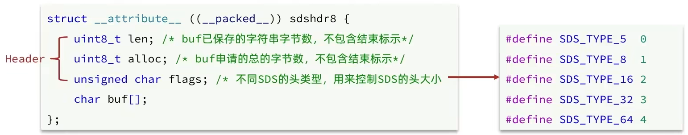
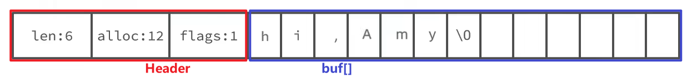

因为 C 语言的字符串存在很多问题：

- 获取字符串长度需要遍历，效率低
- 非二进制安全（无法处理 '\0' 等特殊字节）
- 不支持动态扩容

所以 Redis 没有直接使用 C 语言的字符串，而是构建了一种新的字符串结构：**SDS(Simple Dynamic Strings)，简单动态字符串**

## SDS 的结构

SDS 本质上是一个结构体， char[] 由 SDS 自己来管理

根据字符串长度的不同，SDS 提供多种结构体实现来支持不同大小的字符串（如下图中为 sdsdr8），以节省内存空间

## 动态扩容——**内存预分配**

当向 SDS 追加字符串超出当前容量时，会自动申请更大的内存：

- 新字符串长度 < 1MB：新容量 = 扩展后长度 x 2 + 1
- 新字符串长度 >= 1MB：新容量 = 扩展后长度 + 1MB + 1（每次固定增长 1MB，防止几何增长造成浪费）

结构就分为这两部分：

- Header：记录当前字符串的长度等信息，便于读取
- buf[]：真实存储字符串的 char[]

## SDS 的优点

1. O(1) 时间获取字符串长度
2. 支持自动扩容
3. 内存预分配 -> 减少内存分配次数
4. 二进制安全（可安全处理包含 \0 的数据）
    -> 正因为 SDS 是字节存储，所以也支持存音频、视频等二进制大对象（但不推荐，毕竟内存贵）