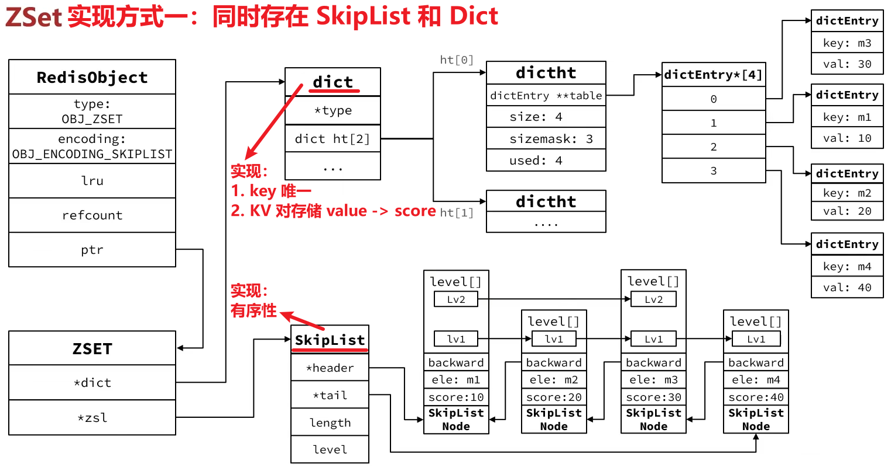
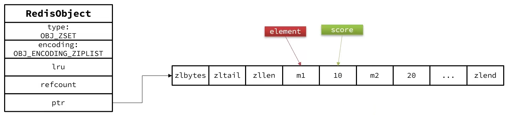

Zset = SortedSet，有序集合

## 特点 & 底层实现

ZSet 必须满足以下特点：

- 键值存储（member -> score）
- 键（member）必须唯一
- 有序性（根据 score 值排序）

底层采用了两种方式：**SkipList + Dict**、**ZipList**

### 方式一：SkipList + Dict

1. 利用 Dict 实现 -> **键唯一**、**键值存储**
2. 利用 SkipList 实现 -> **有序性**

所以，上面两种方式 ZSet 全都要，结构如下（注：o->encoding 只写了 SKIPLIST，但是其实是 Dict 和 SkipList 两种）：

缺点：内存占用太高！

### 方式二：当元素数量不多时，会采用 ZipList 来存储 -> **节省空间**

当元素数量不多时，HT 和 SkipList 的优势不明显，而且更占内存
-> 因此 ZSet 还会采用 ZipList 结构来节省内存，不过需要同时满足两个条件时：

1. 元素个数不超过 zset_max_ziplist_entries(默认值 128)
2. 元素大小不超过 zset_max_ziplist_value(默认值 64 字节)

结构如下：

ZipList 本身没有排序功能，也没有键值对的概念，因此需要用 ZSet 结合业务逻辑来实现：键值存储、键唯一、有序性，具体思路：

- ZipList 是连续内存，因此 score 和 element 是紧挨在一起的两个 entry，element 在前，score 在后
- score 越小越接近队首，score 越大越接近队尾，按照 score 值升序排列

### 总结

初始化过程中会判断采用哪种方式，初始方案：ZipList，最终方案：SkipList + Dict(哈希表)