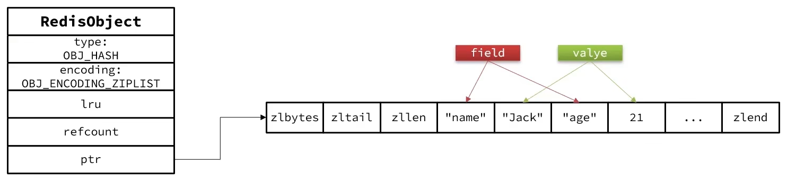
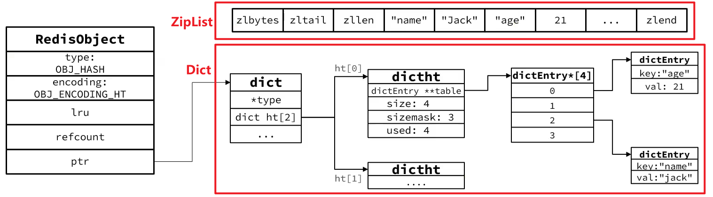

## 特点 & 底层实现

Hash 结构和 ZSet 非常相似

Hash 必须满足以下特点：

- 键值存储
- 键必须唯一

区别：

- ZSet 的 key(member) 是字符串，value(score) 是数值；而 Hash 的 key(field) 和 value 都是任意值
- ZSet 需要根据 score 排序；而 Hash 无需排序

因此，Hash 底层采用的编码与 ZSet 基本一致，只是去掉了排序相关的 SkipList
-> 两种方式：**ZipList**、**Dict**：

### 数据量较少时 -> 采用 ZipList 编码（默认）

节省内存，ZipList 中相邻的两个 entry 分别存储 field 和 value

### 数据量较大时 -> 采用 HT 编码（Dict）

触发条件有两个（满足其中之一）：

1. ZipList 中的元素个数 > hash_max_ziplist_entries(默认值 512)
2. ZipList 中的元素大小 > hash_max_ziplist_value(默认值 64 bytes)

### 为什么需要从 ZipList 升级？

Redis 的 Hash 之所以这样设计，是因为当 ZipList 变得很大的时候有以下性能问题：

- 每次插入/修改会引发 realloc 操作，有更大的概率造成内存拷贝
- 内存拷贝的成本也相应增加，因为要拷贝更大的一块内存
- 当 ZipList 数据项过多时，查找指定的数据项性能很差，因为 ZipList 需要线性便利所有项