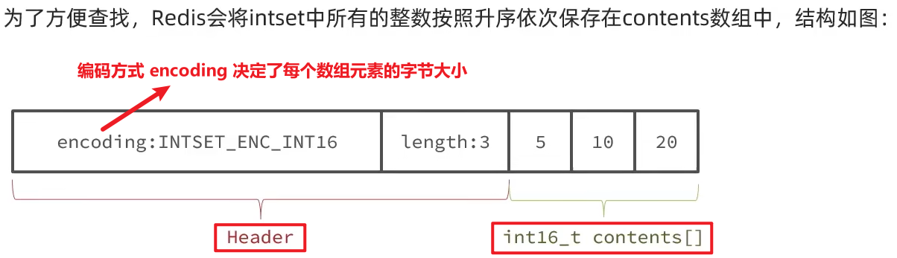
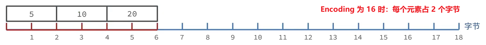
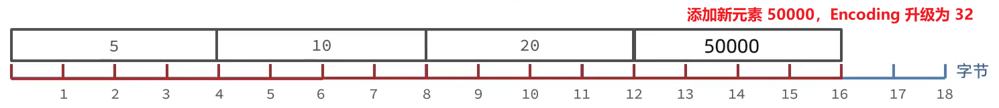

IntSet 是 Redis 中 Set 集合的一种实现方式，具备**有序、元素唯一的、长度可变**的特点

是对 C 语言中整数数组的封装和增强，对数组的增删改查都由 IntSet 来维护

在这个数组中，每个元素的大小都是固定的，所以将来查找时就可以通过第一个元素的内存地址，再根据距离和一个元素的大小，通过一个数学表达式快速寻址：startPtr + (sizeof(int16) * index)

## IntSet 的编码自动升级机制

当插入的整数超出了当前 encoding 所能表示的范围时，IntSet 会自动升级数组中所有元素的编码格式（不可逆）

比如当前编码为 int16，但插入一个需要 int32 才能表示的值时，整个数组会升级为 int32

为了避免内存重叠时数据被覆盖，IntSet 在迁移数据时采用**倒序拷贝（从后往前复制）**的方式

## 有序性

IntSet 内部维护元素有序 -> 使用二分查找来提升查找效率

## 使用场景

由于 IntSet 依赖**连续内存空间**，所以适用于元素数量较少的场景