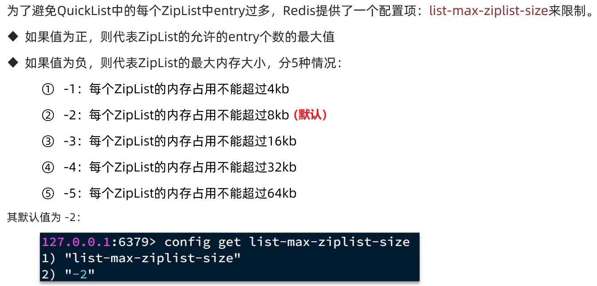
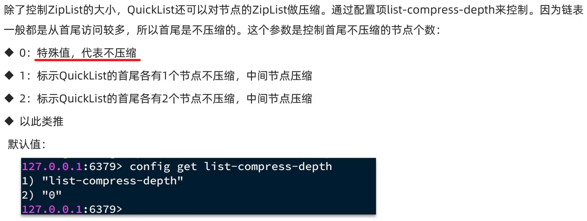
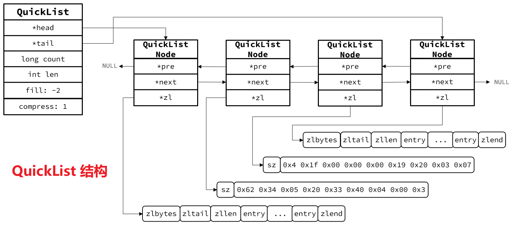

## QuickList 简介

可以理解为：**LinkedList + ZipList**

特殊的双端链表，每一个节点都关联了一个 ZipList

针对 **ZipList 存在的问题**：

1. 虽然节省内存，但是**申请内存必须是连续空间**，如果内存占用较多，申请内存效率会很低
-> 为了缓解这个问题，我们必须限制 ZipList 的长度和 Entry 大小

1. 但是我们要存储大量数据，超出了 ZipList 最佳的上限怎么办
-> 创建多个 ZipList，分片存储数据

## 压缩 ZipList

QuickList 除了能控制 ZipList 的大小，还可以对节点的 ZipList 进行压缩

## QuickList 的结构

## QuickList 的特点

- 是一个节点为 ZipList 的双端链表
- 节点内部**采用 ZipList，解决了传统链表的内存占用问题**
- **控制了 ZipList 的大小，解决连续内存空间的申请效率问题**
- **中间节点可以压缩，进一步节省了内存**

总而言之：**QuickList 兼具了链表和 ZipList 的优点**！