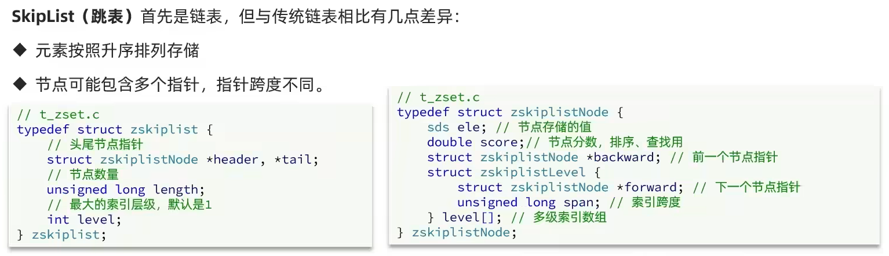
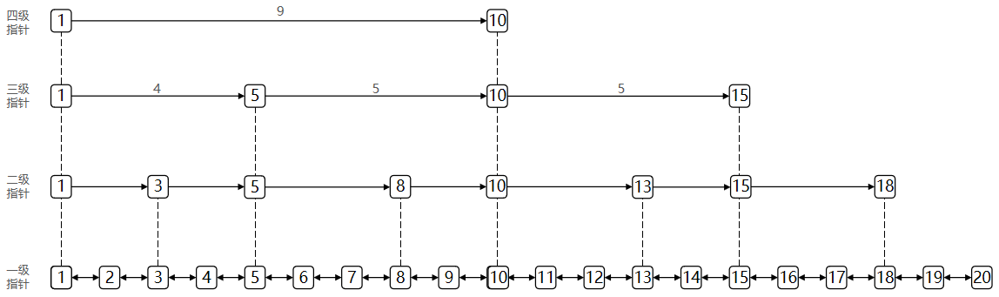
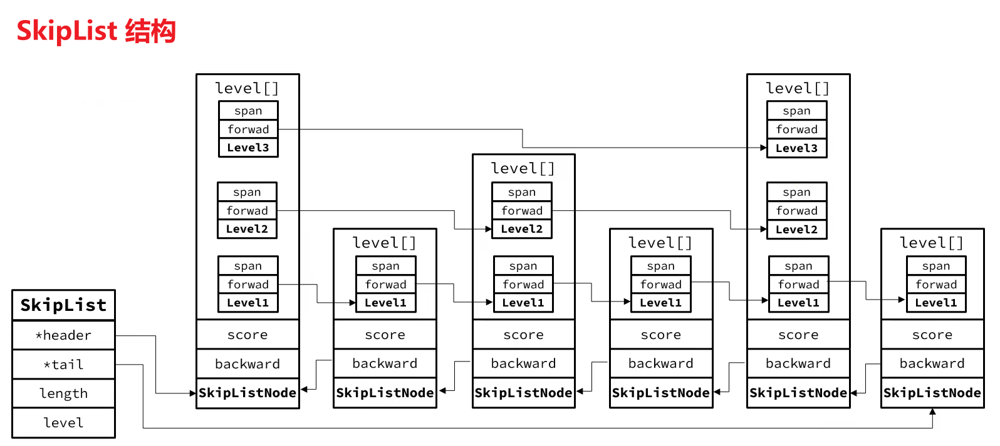

空间换时间，操作的时间复杂度是 **O(logN)**，证明略

## 特点总结

- 跳表是一个双向链表，每个节点都包含 score 和 ele 值
- 节点优先按照 score 值排序，score 值一样则按照 ele 字典排序
- 每个节点都可以包含多层指针，层数范围是 [1, 32]
- 不同层指针到下一个节点的跨度不同，层级越高，跨度越大
- 增删改查效率与红黑树基本一致，实现却更简单