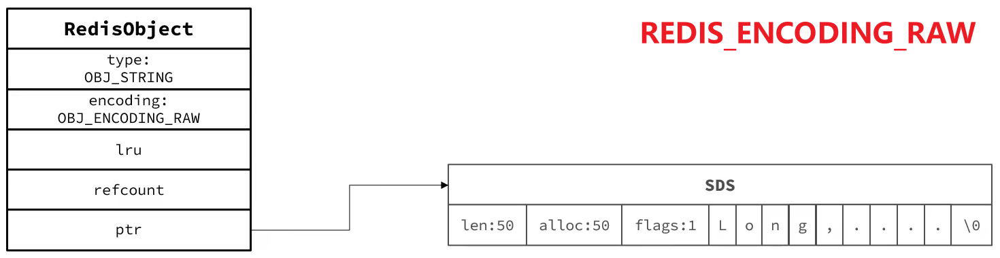
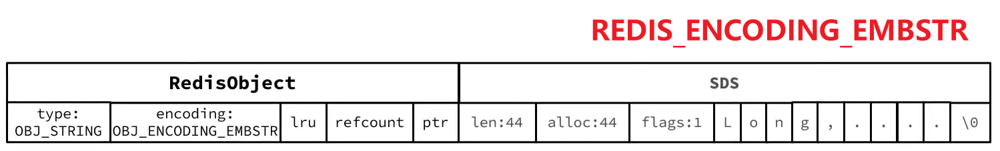
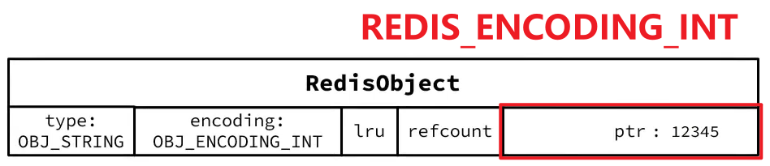

String 是 Redis 中最常见的数据存储类型

## 底层实现

会根据 SDS 的长度来决定采用什么编码方式/实现方式，有 3 种：

1. **RAW 编码**（基本的编码格式），基于 SDS 实现，存储上限为 512 MB（可以自己配置）

2. 如果存储的 SDS 长度小于等于 44 bytes -> 采用 **EMBSTR 编码**，此时 **object head 与 SDS 是一段连续内存空间，申请内存时只需要调用一次内存分配函数**，效率更高
   

3. 如果存储的字符串是整数值，并且大小在 LONG_MAX 范围内 -> 采用 **INT 编码**：直接将数据保存在 RedisObject 的 ptr 指针位置（刚好是 8 bytes），不再需要 SDS 了

确切来说，String 在 Redis 中是用一个 robj 来表示的