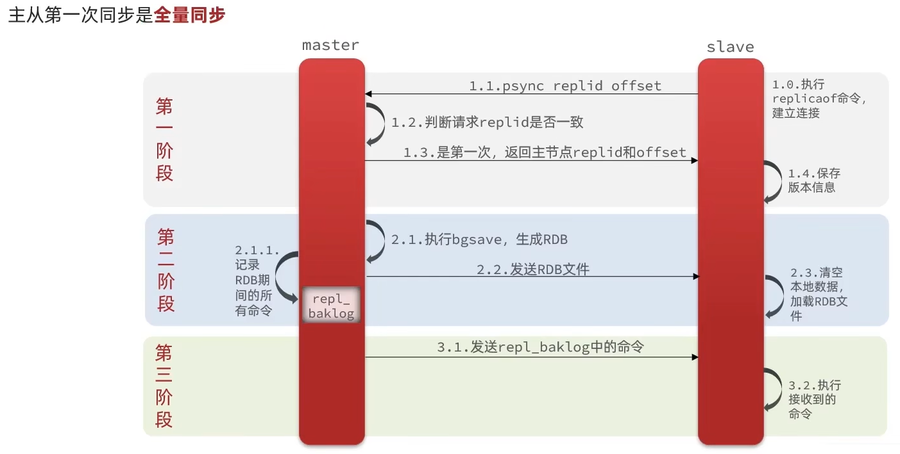
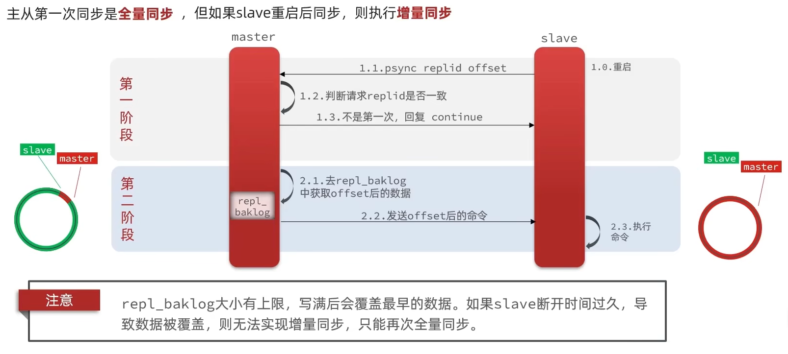
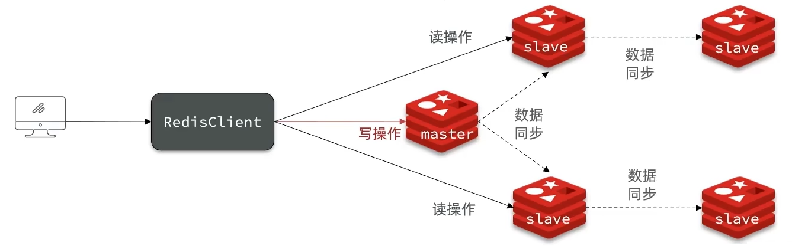

## 两个重要概念

master 判断 slave(replica 同义) 是不是第一次同步数据的逻辑涉及到两个重要概念：

- **Replication Id**：简称 **replid**，是数据集的标记，id 一致则说明是同一个数据集。每一个 master 都有唯一的 replid，slave 则会继承 master 节点的 replid。
- **offset**：偏移量，随着记录在 repl_baklog 中的数据增多而逐渐增大。slave 完成同步时也会记录当前同步的 offset。如果 slave 的 offset < master 的 offset，则说明 slave 数据落后于 master，需要更新。(如果相等则说明当前是数据一致的。)

因此，slave 做数据同步时，必须向 master 声明自己的 replication id 和 offset，master 才可以判断到底需要同步哪些数据。

## 全量同步

全量同步的流程：

1. slave 节点请求增量同步
2. master 节点判断 replid，发现不一致，拒绝增量同步
3. master 将完整内存数据生成 RDB，发送 RDB 文件到 slave
4. slave 清空本地数据，加载 master 的 RDB
5. master 将 RDB 期间的命令记录在 repl_baklog，并持续将 log 中的命令发送给 slave
6. slave 执行接收到的命令，保持与 master 之间的同步

## 增量同步

## 如何优化 Redis 主从集群

可以从几个方面优化 Redis 主从集群：

- 在 master 中配置 repl-diskless-sync 为 yes 来启用无磁盘复制 -> 避免全量同步时的磁盘 IO
- Redis 单节点上的内存占用不要太大 -> 减少 RDB 导致的过多磁盘 IO
- （1）适当提高 repl_baklog 的大小（2）发现 slave 宕机时尽快实现故障恢复 -> 尽可能避免全量同步
- 限制一个 master 上的 slave 节点数量，如果 slave 实在是太多，可以采用**主-从-从链式结构**，减少 master 压力。

## 总结

### 全量同步和增量同步的区别？

- 全量同步：master 将完整内存数据生成 RDB，发送 RDB 到 slave。后续命令则记录在 repl_baklog，逐个发送给 slave。
- 增量同步：slave 提交自己的 offset 到 master，master 获取 repl_baklog 中 offset 之后的命令给 slave

### 什么时候执行全量同步？

- slave 节点第一次连接 master 节点时
- slave 节点断开时间太长，repl_baklog 中的 offset 已经被覆盖时

### 什么时候执行增量同步？

slave 节点断开又恢复，并且在 repl_baklog 中能找到 offset 时