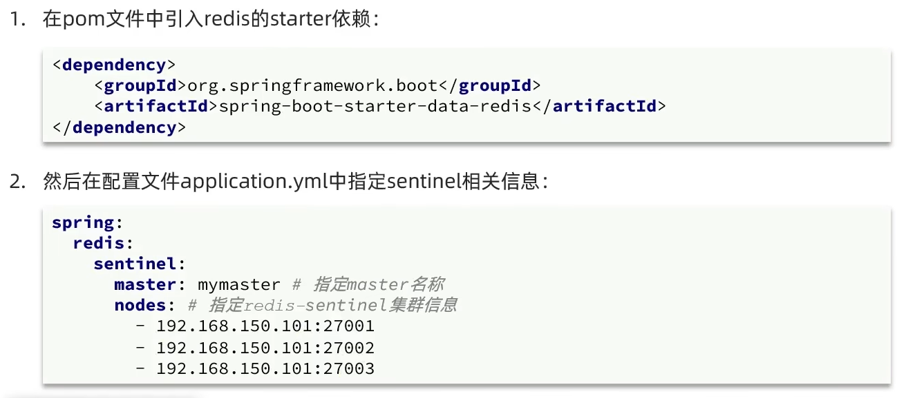
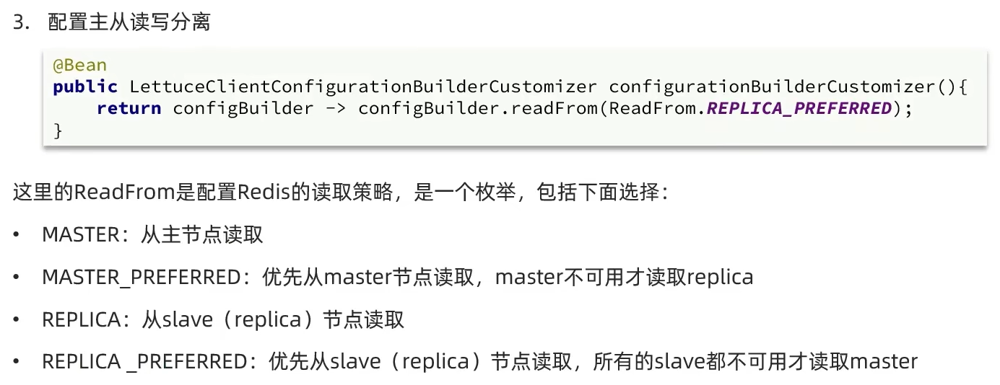

在使用 Redis Sentinel 模式管理的主从集群中，当主节点发生故障时，哨兵会自动进行主从切换。由于节点角色会动态变化，客户端必须具备自动识别新主节点并更新连接信息的能力。

Spring 提供的 RedisTemplate 默认使用 Lettuce 客户端，它支持哨兵模式下的主从切换感知，能够自动连接到新的主节点，确保服务不中断、数据读写正常。换句话说：使用 RedisTemplate + Lettuce 可以无缝支持 Redis Sentinel 模式下的故障转移，无需手动干预。

## 使用

