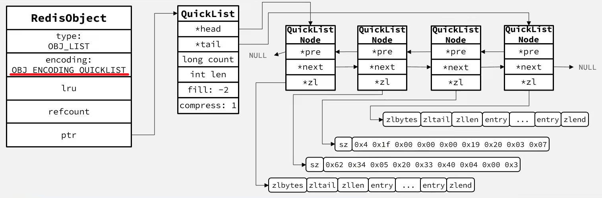

Redis 的 List 结构类似一个双端链表

## 特点

- 有序
- 可以重复
- 可以双端操作

## 底层实现

版本区别：

- ~在 3.2 版本之前，Redis 采用 ZipList 和 LinkedList 来实现 List，当元素数量不超过 512 并且元素大小不超过 64 bytes 时采用 ZipList 编码，有其中一项超过则采用 LinkedList 编码~
- **在 3.2 版本之后，Redis 统一采用 QuickList 来实现 List**

结构如下：

