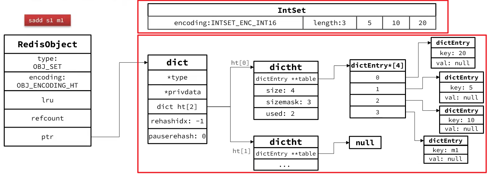

## 特点

- 无序
- 元素唯一
- 可以求交集、并集、差集

## 底层实现

Set 对随机查询效率要求极高

- （默认）为了查询效率和唯一性，采用 **HT 编码**，Dict 中的 key 用来存储元素，value 统一为 null
- 当存储的所有数据都是整数，并且元素数量不超过 set-max-intset-entries 时，Set 会采用 **IntSet 编码**，以节省内存

每次插入都会检查是否满足：都是整数 && 数量不超过set-max-intset-entries，如果不满足，就会将 IntSet 编码转换为 HT 编码

结构如下：

