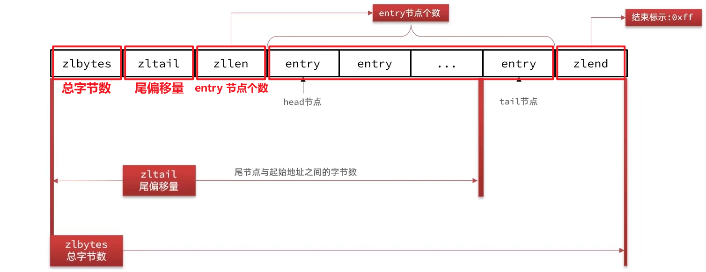
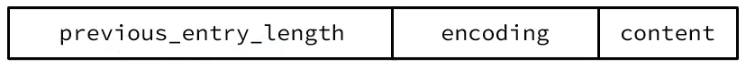
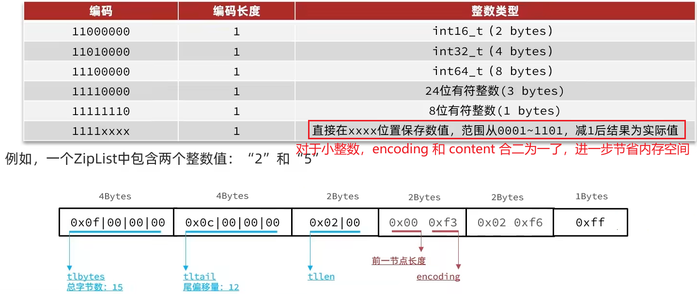
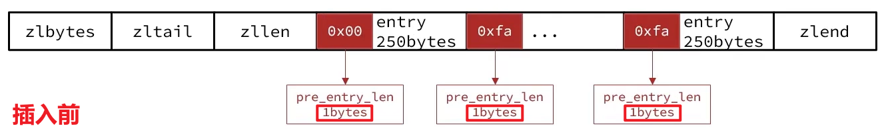
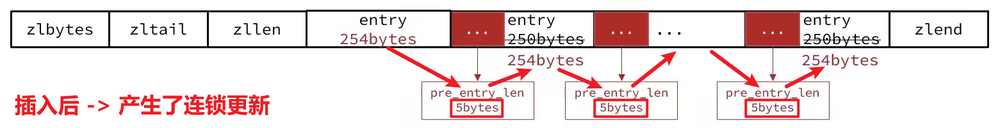

ZipList 是一种特殊的“双端链表”（不是真正意义上的），由一系列特殊编码的**连续内存**块组成。可以在任意一端进行压入/弹出操作，并且该操作的时间复杂度为 **O(1)**。

当然它不是真正意义上的链表，因为**列表的节点之间不是通过指针连接的，而是通过记录上一节点和本节点的长度来寻址 -> 省内存 + 访问速度快**！

## ZipList 的结构

这是一片连续的内存空间，前三部分（zlbytes、zltail、zllen）是头信息。

**zlbytes**（uint32_t, 4 bytes）：压缩列表的总字节数
**zltail**（uint32_t, 4 bytes）：尾节点的偏移量（尾节点的起始地址、起始节点之间的字节数）-> 所以能快速定位 -> 所以能快速压入/弹出
**zllen**（uint16_t, 2 bytes）：entry 节点的个数

第一个 **entry** 称为头节点 head，最后一个 entry 称为尾节点 tail。**每个 entry 节点的长度是不固定的，由节点保存的内容决定**。

最后的 **zlend** 是整个压缩列表的结束标识（uint8_t, 1 byte, 值是固定的——0xff）。

## ZipList 中的 Entry 的结构

ZipList 中的 Entry 并不像普通链表那样记录前后节点的指针，因为记录两个指针要占用 16 个字节，浪费内存。它采用的是下面的结构：

**previous_entry_length**（1 byte / 5 bytes）：前一个节点的长度。如果：
- 前一个节点的长度 < 254 bytes：采用 1 byte 来保存这个长度值
- 前一个节点的长度 >= 254 bytes：采用 5 bytes 来保存这个长度值，第一个字节固定为 0xfe，后四个字节才是真实长度数据（四个字节挺大的，所以不推荐让单个数据占用过多内存）
**encoding**：编码属性，记录 content 的数据类型（字符串 / 整数）以及长度，占用 1 byte / 2 bytes / 5 bytes
**contentss**：负责保存节点的数据，可以是字符串或整数

## 补充

ZipList 中所有存储长度的数值均采用小端字节序，即低位字节在前，高位字节在后。例如：数值 0x1234，采用小端字节序后实际存储值为 0x3412。

## ZipList 中的 Entry 中的 Encoding 的结构

ZipList 中的 Entry 中的 encoding 编码分为字符串和整数两种：

1. 字符串：如果 encoding 是以 00 / 01 / 10 开头，则说明 content 是字符串，

- | 00pppppp |
编码长度为 1 bytes，字符串大小 <= 63(2^6-1) bytes
- | 01pppppp | qqqqqqqq |
编码长度为 2 bytes，字符串大小 <= 16383(2^14-1) bytes
- | 10000000 | qqqqqqqq | rrrrrrrr | ssssssss | tttttttt |
编码长度为 5 bytes，字符串大小 <= 4294967295 bytes

2. 整数：如果 encoding 是以 11 开头，则说明 content 是整数，且 encoding 固定只占用 1 个字节

（编码格式和具体整数类型之间的对应关系省略，感觉学习意义不大）

## ZipList 的缺点

和双向链表类似，**只能从前往后 / 从后往前遍历，那如果列表数据过多，就可能影响查询性能**。

## ZipList 的连锁更新问题（Cascade Update）

如前所述，ZipList 中的每个 Entry 都包含 previous_entry_length 字段，用于记录上一个节点的长度。这个字段的长度可能是：**1 byte（当长度 <= 253 bytes）；也可能是 5 bytes（当长度 > 253 字节）**。假设现在有 N 个连续的**长度为 250~253 bytes**的 Entry，此时每个 Entry 的 previous_entry_length 只需要 1 byte 就可以表示。

但是，如果我们在中间插入一个**长度超过 253 bytes**的新 Entry，那么它后面的那个 Entry 的 previous_entry_length 字段就必须从 1 byte 扩展为 5 bytes！这会使这个 Entry 的空间发生变化，**进而影响下一个 Entry 的偏移计算**，从而引发一连串的结构更新（推动后续每个节点向后移动）——这就是“连锁更新”。

新增、删除都可能导致连锁更新，只要影响了 previous_entry_length 的编码方式，就有可能引发这种“向后传染”的更新行为。虽然发生的概率极低，但是一旦触发会造成频繁的内存申请、销毁、迁移，以及用户态与内核态之间频繁的内存拷贝，影响性能。