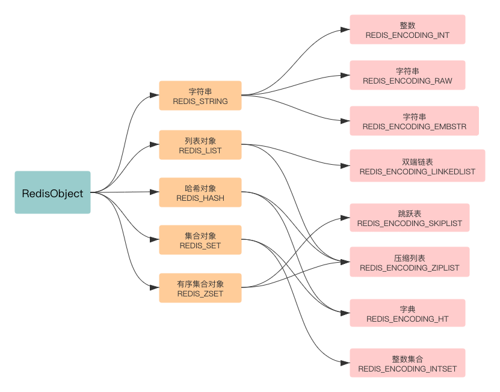

## 简介

value 底层的 6 种数据机构：

- SDS (简单动态字符串)
- IntSet (整型数组)
- Dict (字典/哈希表)
- ZipList (压缩列表)
- SkipList (跳表)

这些数据结构最终作为 value 底层存储的数据形式，并且会被封装在一个 RedisObject 中

## Redis 的编码方式

Redis 会根据存储数据的类型不同，选择不同的编码方式

RedisObject 、Redis 所有数据类型、Redis 所有编码方式（底层实现）三者之间的关系

