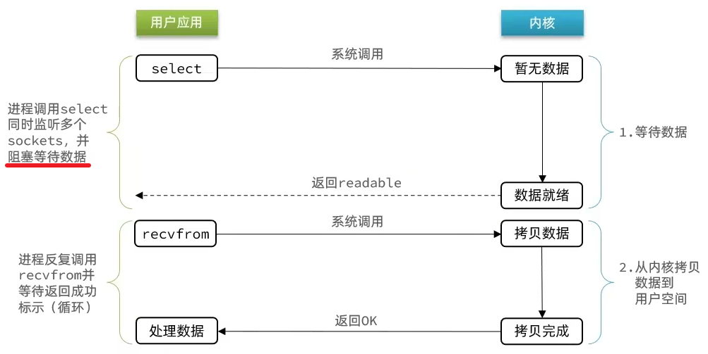

## 用户空间和内核空间

在操作系统中 **CPU 有两种运行状态：用户态（User Mode）、内核态（Kernel Mode）**。
当进程运行在内核空间时称为内核态，当进程运行在用户空间时称为用户态。
应用程序运行在用户态，一些操作系统的程序运行在内核态。
用户态下只能执行一些非特权指令，如果应用程序需要执行一些特权指令（如磁盘的 IO、网络通信等），必须通过**中断机制**从用户态切换到内核态，并将处理权交给操作系统，由操作系统来完成特权指令。
为此，操作系统向用户空间提供了一组标准接口，即**系统调用（System Call）**，这是用户程序访问内核服务的唯一通道。

## Linux 的五种 IO 模型

- BIO = Biocking IO (阻塞 IO)
- NIO = Nonblocking (非阻塞 IO)
- IO Multiplexing (IO 多路复用)
- Signal Driven IO (信号驱动 IO)
- AIO = Asynchronous IO (异步 IO)

应用程序想要读取数据，是无法直接读取磁盘数据的，需要先在内核中等待内核操作硬件拿到数据。

不同 IO 模型之间的差异主要体现在两点：(1) 数据准备好前，用户线程是否会阻塞；(2) 数据准备好后，从内核空间拷贝到用户空间时是否阻塞。

### 阻塞 IO

应用发起系统调用后，线程从用户态转换为内核态，如果数据没有到达（事件未就绪），当前线程就会**阻塞**在内核中，一直等到数据就绪并完成拷贝，整个过程线程无法做任何其他事，效率极低，资源利用差。

### 非阻塞 IO

应用发起系统调用后，如果数据未就绪 -> **立即返回**，线程不会阻塞。但是用户（应用线程）会定期不断地轮询内核，直到数据就绪 -> 造成用户态和内核态频繁切换，导致 CPU 空转。换句话说，线程虽然没有阻塞，但是一直询问的状态也是一种盲等，没有做任何实际意义的事情。

非阻塞 IO 的**等待数据阶段是非阻塞的**，但是**拷贝数据阶段（从用户空间拷贝到内核空间的过程）依旧是阻塞的**。

### IO 多路复用

文件描述符（File Description, FD）：Linux 中一切皆文件，FD 是应用程序访问文件、视频、硬件设备、套接字（Socket）等资源的句柄（一个从 0 开始递增的无符号整数）

阻塞 IO 和非阻塞 IO 的区别在于系统调用时无数据的差异，一个是会一直等，一个是不断忙着轮询去问，CPU 空转，这两种处理方式在单线程下都不是很好。那如何在单线程的情况下达到高效率呢？
-> 为了提升单线程处理多个连接的能力，引入了 IO 多路复用：

- 一个线程使用 select/poll/epoll 等机制来监听多个 FD（文件描述符）
- 当任一 FD 有事件发生（可读/可写）时，线程才被唤醒，去执行相应逻辑
- 避免了多线程阻塞，也减少了无效的轮询，适用于**高并发连接但低流量**的场景

不过基于“**监听 FD 通知的方式**”的不同，多路复用 IO 有三种实现方式：select、poll、epoll

### 信号驱动 IO（待补充）

### 异步 IO（待补充）