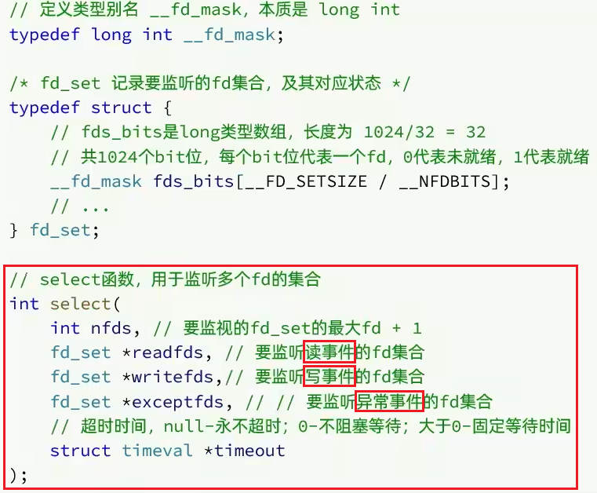
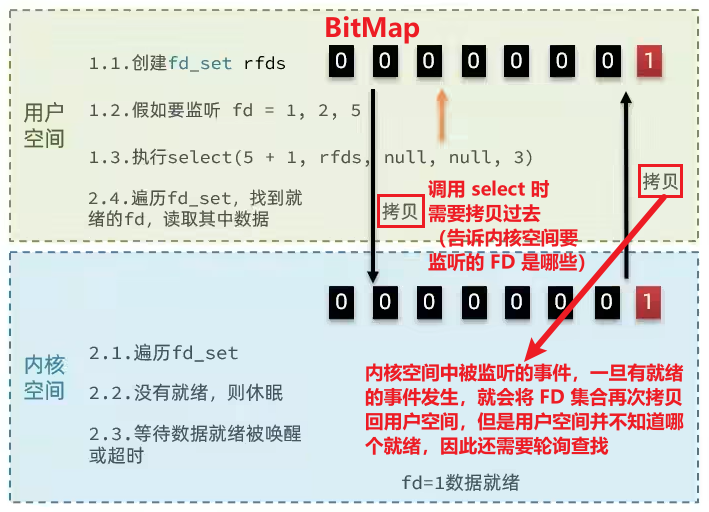
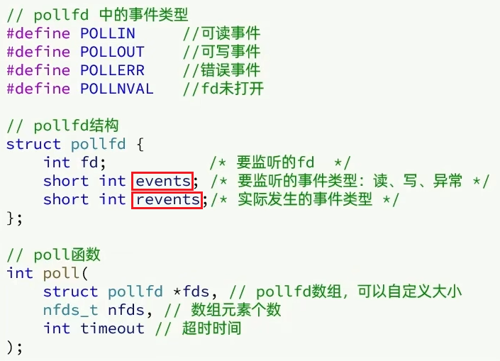
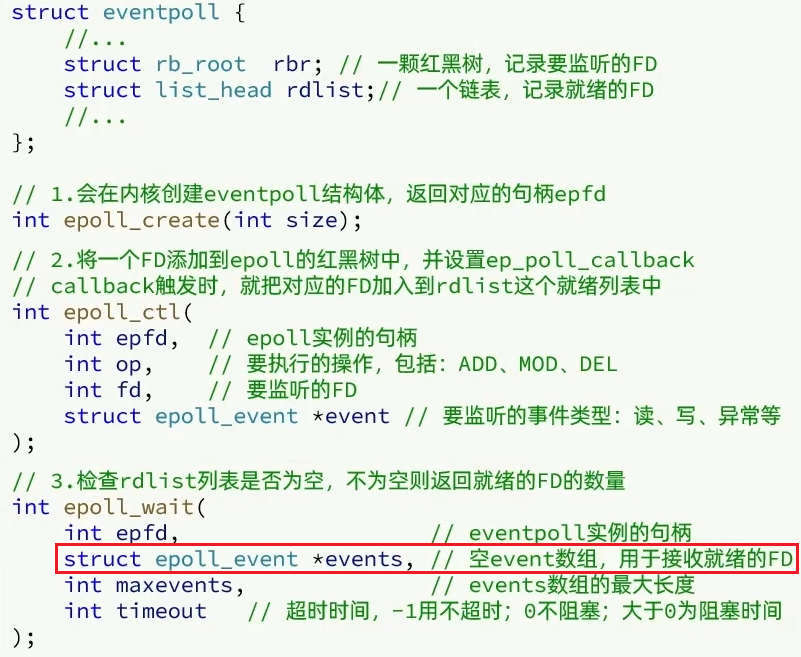
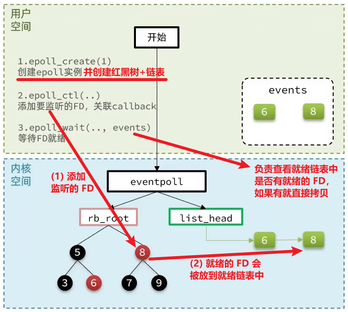
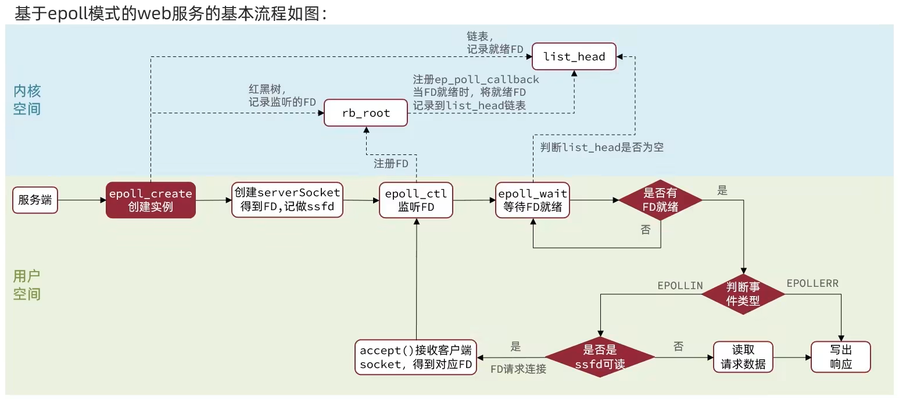
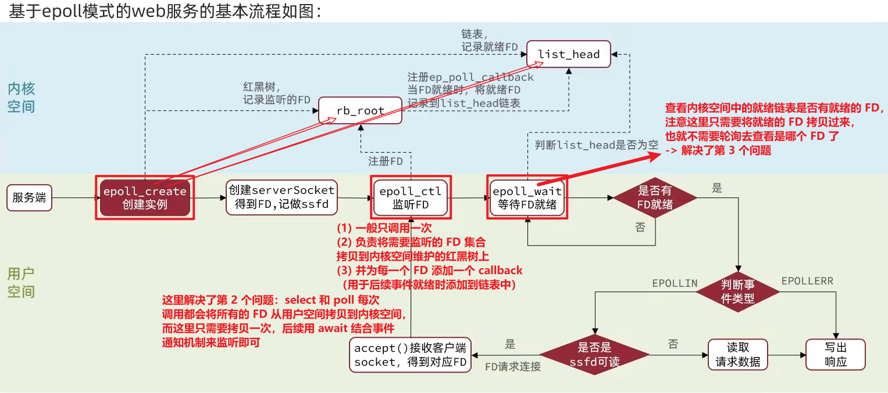

## select

select 是 Linux 最早期的 I/O 多路复用实现方案

它可以同时监听多个 FD，包括：可读事件、可写事件、异常事件

### 工作机制

1. 把需要处理的数据封装成 FD，然后在用户态构建 FD 集合（如监听 1、2、5，集合大小为最大 FD + 1）
2. 使用**二进制位图**标记哪些 FD 被监听（如 00010011）
3. 调用 select()：
    - 将 FD 集合从用户态**拷贝到内核态**
    - 内核态**遍历用户传过来的所有 FD，检查是否就绪**
    - 如果没有 FD 就绪 -> 线程阻塞休眠
    - 有 FD 就绪 -> **再次遍历**，清除未就绪的 FD（设为 0）
    - **将 FD 集合拷贝回用户态**
4. 用户态程序需**再次遍历整个 FD 集合**，找到对应就绪数据的节点，再去发起读请求（因为用户进程并不知道哪个是就绪的 FD）

### select 模式存在的问题

1. FD 数量限制：fd_set 最大支持 1024 个 FD
2. 数据拷贝开销大：每次调用 select 都要进行两次拷贝（用户态->内核态，内核态->用户态）（epoll_ctl 只调用一次，剩余都在 epoll_wait）
3. 轮询机制低效：select 无法得知具体是哪个 FD 就绪，需要轮询查找整个 fd_set，效率很低（epoll_wait 只返回已经就绪的事件，不会全都返回）

## poll

### 与 select 对比

- 突破了 1024 FD 的限制：select 模式中的 fd_set 大小固定为 1024；而 poll 使用 pollfd 数组表示监听对象，在内核中采用链表，理论上没有上限 :)
- 仍然是**遍历所有 FD**，效率不高——而且 pollfd 没有上限，监听的 FD 越多每次遍历消耗时间也就越久，性能反而会下降 :(
- 仍然需要**拷贝两次** :(

也就是说：**与 select 相比，poll 只解决了监听的 FD 集合数量有限的问题**

### 工作机制

1. 创建 pollfd[] 数组（大小自定义），向其中添加关注的 FD 信息
2. **调用 poll()：
   - 拷贝整个 pollfd 数组到内核态，转为链表存储 -> 无上限
   - 内核遍历 FD，判断是否就绪
   - **等待数据就绪/超时 -> 拷贝 pollfd 数组到用户空间**，返回就绪 fd 的数量 n
3. 用户进程判断 n 是否大于 0 -> 是：遍历 pollfd[] 数组，找到就绪的 FD

## epoll

是为了解决 select 和 poll 的性能瓶颈而提出的高效 I/O 多路复用机制

### 三个核心函数 & 结构

1. **epoll_create**：在**内核空间中**创建 eventpool 实例，一个 eventpool 内部维护了以下数据结构：

(1) **一个红黑树（rb_root）**：维护要监听的 FD（未就绪时在这里）
(2) **一个链表（list_head）**：维护已经就绪的 FD（就绪之后在这里）

2. **epoll_ctl**：将一个要监听的 FD 添加内核态的 eventpoll 实例中维护的红黑树中，并为每一个要监听的 FD 绑定一个 callback()，这个函数会在 FD 数据就绪时触发，将这个 FD 添加到就绪列表（list_head）

**关键优势**（区别于 select 和 poll）：FD 只**拷贝一次**，之后只需通过 epoll_wait() 获取事件，极大减少了用户态和内核态之间的通信开销

3. **epoll_wait**：等待事件发生，**用户态创建并传入一个空的 events[] 数组**，当调用这个函数时内核会去检查 list_head（这个过程根据配置的等待时间，可以等一定的时间，也可以一直等），如果在此过程中检查到了 list_head 中有添加数据，就将数据放入到 events[] 数组中，并返回对应的操作的数量，用户态此时收到响应后就会从 events[] 中拿到对应就绪数据的节点进行处理。

### epoll_ctl() 和 select()、poll() 的区别

- select() 和 poll() 都是会将监听的 FD 拷贝到内核空间，然后**阻塞等待就绪的事件**，一旦事件就绪，就会拷贝返回给用户空间
- epoll_ctl() 只会将一个要监听的 FD 添加到 eventpool 的红黑树中，而不会等待事件的就绪，**不会阻塞**

### 如何知道是哪些 FD 就绪了？

- select 和 poll 的实现中，只要当事件就绪了，就会将所有的 FD（不论就绪还是未就绪的）拷贝回用户空间，然后用户空间去做一个轮询
- epoll_wait() 只会将内核空间中的就绪链表中已经就绪的 FD 集合拷贝回去，而不是全部拷贝（实现方式是：调用 epoll_wait() 时在参数中传递了一个空的 events[] 数组，所以可以直接将它们拷贝到数组中）

**epoll 如何解决这三种缺陷：**

1. 解决了监听的 FD 数量的限制
2. select 和 poll 每次调用 select() 和 poll() 都会将监听的所有 FD 集合拷贝到内核空间，而 epoll 采用了两个函数：epoll_ctl() 会将监听的 FD 拷贝到 eventpool 维护的红黑树上，**只会拷贝一次**；然后添加一个 callback()，用于事件就绪时将其添加到就绪链表中，所以该模式下**只需要调用一次 epoll_ctl() 即可（FD 只会拷贝一次）**，后续只需要不断调用 epoll_wait() 来对就绪链表上的就绪的 FD 进行监听即可，不需要重复地将要监听的 FD 从用户空间拷贝到内核空间
3. select 和 poll 每次 FD 就绪后，拷贝回用户空间的都是所有的 FD 集合（包括就绪的、没就绪的），而 epoll 每次拷贝回用户空间的只有已经就绪的 FD，所以不需要轮询查找哪些是就绪的了

### epoll-事件通知机制

调用 epoll_wait() 时如果有可读/可写的事件就绪，就会得到事件的通知——“有事件就绪了”，事件通知的方式分为两种（默认是 LT）：

- LT (LevelTriggered，水平触发)：只要 FD 可读/可写，每次调用 epoll_wait() 都会返回
- ET (EdgeTriggered，边缘触发)：只在状态变化（不可读->可读）时通知一次，更高效，但需要配合非阻塞 IO 使用 -> 所以在 ET 模式下，read 一个 FD 时一定要一次性把它的 buffer 读完，因为后续不会再次通知

每次调用 epoll_wait() 时，如果就绪链表中有就绪的事件，会看当前是 LT 还是 ET：
- 如果是 LT -> 不会断开，下次依旧可以返回上次未处理完的 FD
- 如果是 ET -> 直接将链表的指针断开，后续就没有该就绪 FD 了（“给你机会你不中用啊~”）

#### LT 模式的缺陷

1. 因为需要不断地 epoll_wait()，需要多次重复通知 -> 性能上有一定的消耗
2. “惊群现象”：多个进程/线程同时在监听一个 FD，当 FD 就绪时，**所有的进程都会被唤醒** -> 调度浪费

ET 模式：

1. ET 模式避免了 LT 模式可能出现的“惊群现象”
2. ET 模式需要结合非阻塞 IO 读取 FD 数据，相比 LT 会复杂一些

### epoll 在 Web 应用中的典型流程

1. epoll_create()：创建 eventpool 实例，创建一个红黑树和链表
2. 一次 epoll_ctl()：将监听的 FD 集合拷贝到用户空间的红黑树中，并为每个 FD 添加一个 callback() 函数（用于就绪后添加到就绪链表）
3. 多次 epoll_wait()：在主循环中等待链表上已经就绪的 FD，根据不同的事件通知方式来返回对应的 FD
4. 拿到就绪的 FD 后进行读写等处理

### 深刻理解流程图（理解和 select、poll 的区别）

