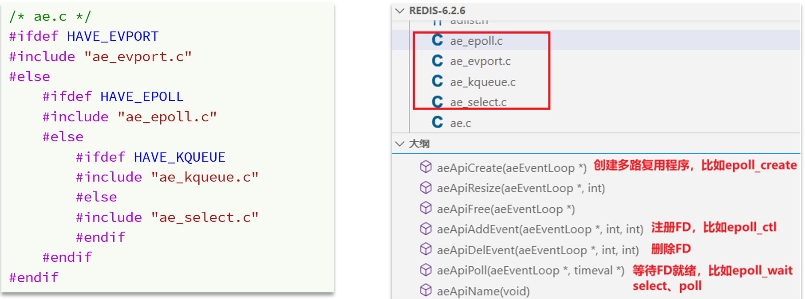

## Redis 到底是单线程还是多线程？

- 如果只是针对一些核心业务而言，对数据的访问操作等都是**单线程**，且结合多路复用的 IO 模型，此情况下是单线程
- 但是对于整个 Redis 而言，是**多线程**，比如持久化时并不会由主进程来完成，而是 fork 一个子进程来完成操作

## Redis 为什么要选择单线程？

- Redis 是纯内存操作，内存的执行速度非常快，Redis 的性能瓶颈不是执行速度，而是网络延迟，所以即使加入了多线程也不会有更多的提升
- 多线程会导致大量的上下文切换，带来不必要的开销
- 需要有合理的系统架构来控制多线程之间的协调性，否则一味地增加线程甚至会效率更低，并且多线程下还有进行共享数据的并发访问控制，提高了很多复杂度

## Redis 网络模型

基于多路复用 IO 来提升网络性能，并且支持多种不同的多路复用实现，都进行了封装，提供统一的 API 库 AE

整体来看，Redis 的网络模型就是基于**IO 多路复用 + 事件派发机制**，就是客户端请求来了之后，我们都会做多路复用的事件监听，无论是什么类型的事件。然后我们提前定义好各种各样的事件处理器。对于不同的事件，我就派发给不同的事件处理器去处理。