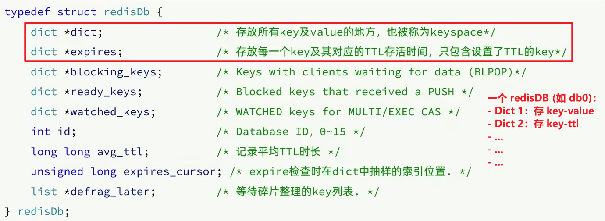
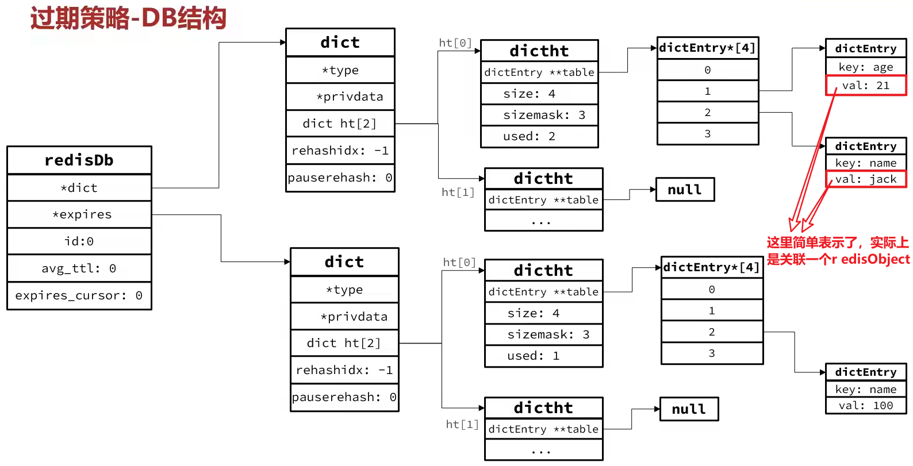

## DB 结构

Redis 如何知道一个 key 过期？
-> 一个库中有两个 Dict 分别记录 key-value 对、**key-ttl 对**

是不是 TTL 到期就立刻删除了？
-> **不是**，具体取决于过期策略

## 数据过期策略

1. 惰性删除：

在访问一个 key 时检查它的存活时间，如果过期 -> 执行删除

2. 定期删除：

**通过一个定时任务周期性地抽样部分 key，删除其中过期的 key**
-> 能确保最终所有 Dict 中的数据都被抽到
-> 不会出现过期 key 一直没清理的情况

定期删除分为两种执行模式：

- SLOW 模式：**低频、高时长**的清理

Redis 会**设置一个定时任务 serverCron()**，按照 server.hz 的频率来执行过期 key 清理，模式为**SLOW**

SLOW 模式规则：
1. 执行频率受 server.hz 影响，默认为 10（即每秒执行 10 次，**每个执行周期 100 ms**）
2. 执行清理的耗时**不超过一次执行周期的 25%**
3. 逐个遍历 db，逐个遍历 db 中的 bucket，抽取 20 个 key 判断是否过期
4. 如果没达到时间上限（**25 ms**）并且过期 key 比例大于 10% -> 再进行一次抽象；否则结束

- FAST 模式：**高频、低时长**的清理

Redis 的**每个事件循环之前会调用 beforeSleep()**，执行过期 key 清理，模式为**FAST**

FAST 模式规则（过期 key 比例小于 10 % 不执行）：
1. 执行频率受 beforeSleep() 调用频率影响，但两次 FAST 模式**间隔不低于 2 ms**
2. 执行清理的耗时**不超过 1ms**（*这里有争议，有的说也是 25%，或许是版本不一致？*）
3. 逐个遍历 db，逐个遍历 db 中的 bucket，抽取 20 个 key 判断是否过期
4. 如果没达到时间上限（**1 ms**）并且过期 key 比例大于 10% -> 再进行一次抽象；否则结束

FAST 策略每次执行时长非常短 -> 减少对主线程的阻塞影响