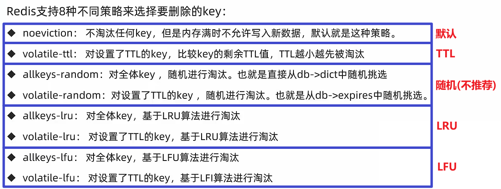
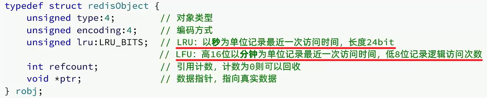
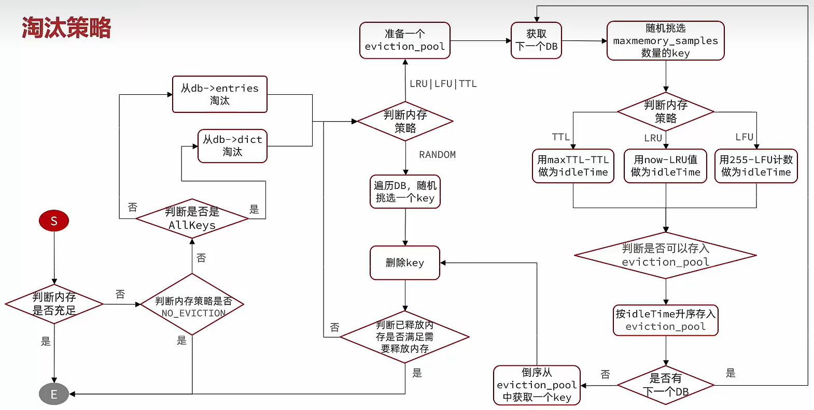

## 概念

内存淘汰：当 Redis 内存使用达到配置的阈值时，会主动挑选**部分 key** 删除以释放更多内存的流程

## 内存淘汰策略

默认配置：

**4 种算法，8 种策略**

比较容易混淆的是 LRU 和 LFU：

- LRU (Least Recently Used，最近最少使用)：当前时间 - 最后一次访问时间，这个值越大则淘汰优先级越高（“很久没来了呢~”）
- LFU (Least Frequently Used，最少频率使用)：统计每个 key 的访问频率，值越小淘汰优先级越高（“来得很少呢~”）

## 其他

1. 如何知道 LRU 中每个 key 最后一次被访问的时间？
2. 如何知道每个 key 被访问的频率？

每个键值对 KV 都会被封装为 RedisObject，根据采用的不同策略，在其中时分别记录着对应的信息（上次访问时间/访问频率）

https://www.bilibili.com/video/BV1cr4y1671t/?p=175