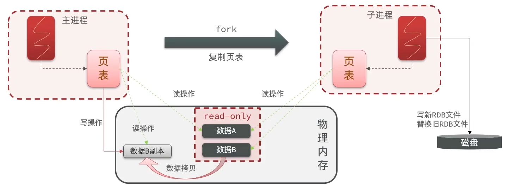

## 概念

RDB(Redis Data Backup file) = Redis 数据备份文件 = Redis 数据快照

把内存中的所有数据都记录到磁盘中。Redis 实例故障重启后，从磁盘读取快照文件恢复数据。

.rdb 文件默认保存在当前运行目录。

## save 命令 和 bgsave 命令

- save：由 Redis 主进程来执行 RDB，会阻塞所有命令
    完成后返回 "ok"
- bgsave：开启子进程异步执行 RDB，避免主进程受到影响
    会立刻返回 "background saving started"

## 配置

Redis 会默认在服务停止时触发 RDB，但是也可以在 redis.conf 中配置，格式如下：

```
# 900 秒内如果至少有 1 个 key 被修改，就执行 bgsave
save 900 1
save 300 10
save 60 10000
# save "" 表示禁用 RDB
# save ""
```

其他常用配置：

```
# 是否压缩，建议不开启，因为也会消耗 CPU，而磁盘相对很不值钱
rdbcompression yes

# RDB 文件名称
dbfilename dump.rdb

# 文件保存的路径目录
dir ./
```

## bgsave 底层实现细节

基本流程：

1. fork 主进程得到一个子进程（这个过程会阻塞主进程），共享**共享**主进程的内存空间（这样速度快）
2. 子进程读取内存数据，异步写入写入新的 RDB 文件
3. 用新的 RDB 文件替换旧的 RDB 文件

fork 采用的是 copy-on-write 技术：

- 当主进程执行读操作时，访问共享内容
- 当主进程执行写操作时，则会拷贝一份数据，执行写操作



## 缺点

- RDB 执行间隔时间长，两次 RDB 之间写入的数据有丢失的风险
- fork 子进程、压缩、写出 RDB 文件都比较耗时