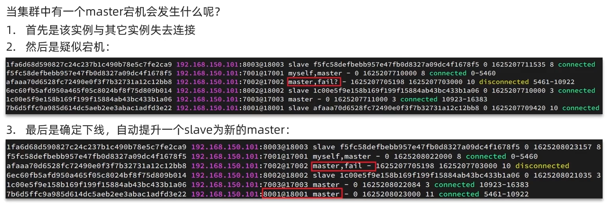
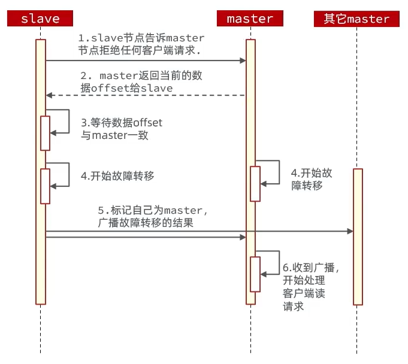

## Automatic Failover(自动故障转移)

为了避免服务宕机而引起的数据损失

## Manual Failover(手动故障转移)

有目的性的服务升级（数据迁移）

利用 cluster failover 命令可以手动让集群中的某个 master宕机，切换到执行 cluster failover 命令的这个 slave 节点，实现无感知的数据迁移。流程如下：

手动的 failover 支持三种模式：

- 缺省：默认的流程，如上图
- force：省略了对 offset 的一致性校验（不交接工作，比较暴力）
- takeover：直接执行第 5 步，忽略数据一致性、忽略 master 状态和其他 master 的意见（更加暴力）