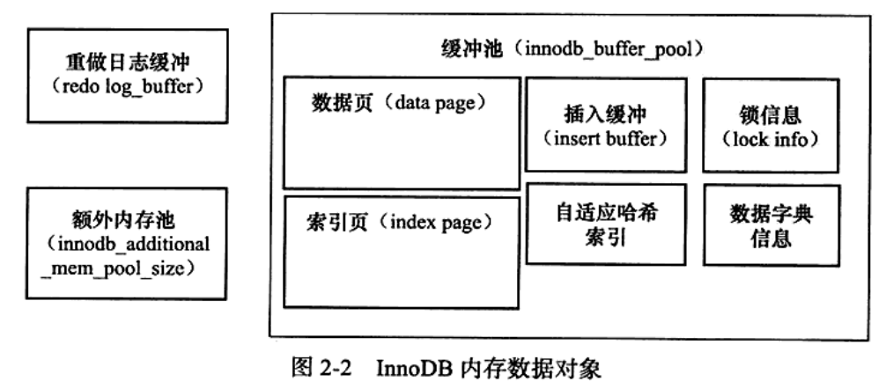
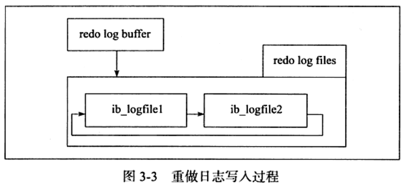
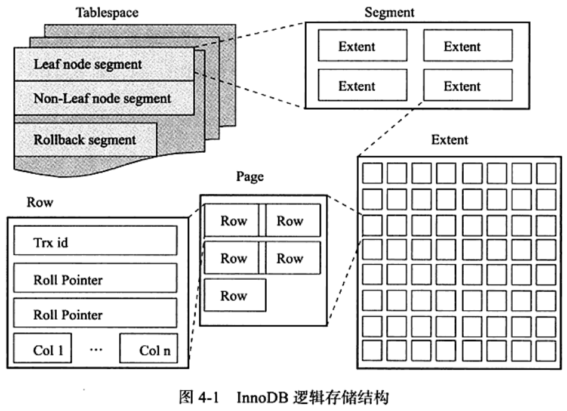
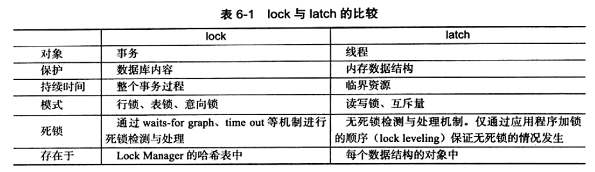
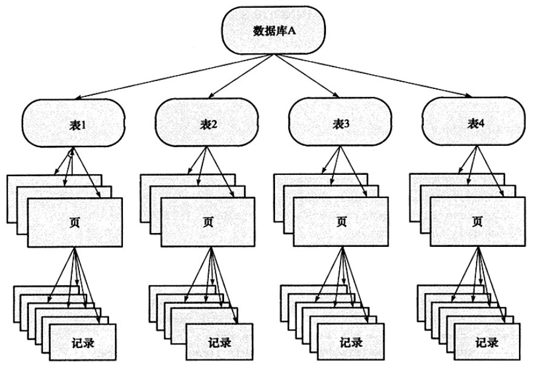
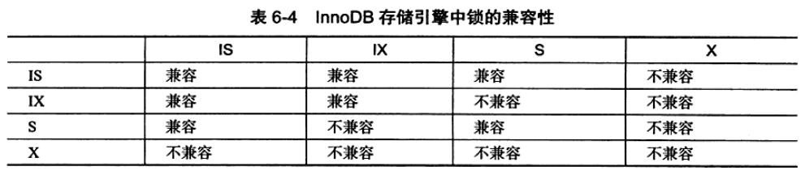
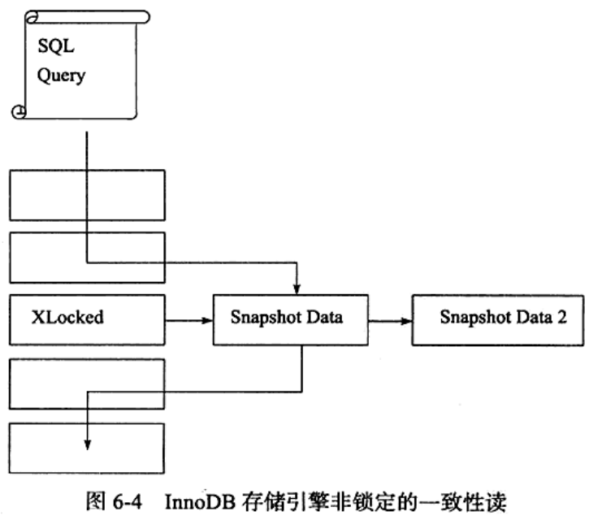

# 1 MySQL 体系结构和存储引擎

## 1.1 定义数据库和实例

* 数据库和数据库实例是两个不同的概念
数据库：是文件的集合
实例：是程序，是真正用于操作数据库文件的

* 关于配置文件读取
MySQL 以读取到的最后一个配置文件中的参数为准

## 1.2 MySQL 体系结构

* 区别于其他数据库最重要的一个特点：插件式存储引擎

* 存储引擎是基于表的，而不是数据库。

## 1.3 MySQL 存储引擎

### 1.3.1 InnoDB 存储引擎

### 1.3.2 MyISAM 存储引擎

* 不支持事务、表锁，支持全文索引，主要面向一些 OLAP 数据库应用

* 它的缓冲池只缓存索引文件，而不缓冲数据文件，这和大多数数据库非常不同

# 2 InnoDB 存储引擎

## 2.1 InnoDB 存储引擎概述

特点：行锁设计、支持 MVCC、支持外键、提供一致性非锁定读

## 2.3 InnoDB 体系架构

InnoDB 存储引擎有多个内存块，组成一个大的内存池，负责：
* 维护所有线程/线程需要访问的多个内部数据结构
* 缓存磁盘上的数据，方便快速读取，同时在对磁盘文件的数据修改之前在这里缓存
* redo log 缓冲
* ...

后台线程的主要作用是负责刷新内存池中的数据，保证缓冲池中的内存缓存是最近的数据。此外将已修改的数据文件刷新到磁盘文件，同时保证在数据库发生异常时 InnoDB 能恢复到正常运行状态。

*（其他存储引擎跳过）*

### 2.3.1 后台线程

1. Master Thread

非常核心的后台线程，主要负责将缓冲池中的数据异步刷新到磁盘，保证数据的一致性。

2. IO Thread

主要负责大量使用了 AIO 的写 IO 请求的回调

4 个 IO Thread：write、read、insert buffer、log IO Thread

3. Purge Thread

回收已经使用并分配的 undo 页

4. Page Cleaner Thread

将之前版本中脏页的刷新操作都放入到单独的线程中完成，目的是为了减轻原 Master Thread 的工作以及对于用户查询线程的阻塞 -> 进一步提高性能

### 2.3.2 内存

1. buffer pool (缓冲池)

一块内存区域，通过内存的速度来弥补磁盘速度较慢对数据库性能的影响（协调 CPU 速度与磁盘速度的鸿沟）。

缓存池中缓存的数据也类型有：索引页、数据页、undo 页、insert buffer、adaptive hash index、lock info、data dictionary 等。



2. LRU List、Free List 和 Flush List

通常来说，数据库中的缓冲池是用 LRU 算法管理的，即最频繁使用的页在 LRU List 的前端，最少使用的页在尾端。当缓冲池不能存放新读取到的页时，首先释放 LRU List 尾端的页。

midpoint insertion strategy: InnoDB 中，缓冲池中页的大小默认为 **16KB**。InnoDB 对传统的 LRU 算法做了优化——加入了 midpoint 位置，默认在 LRU List 长度的 5/8 处。把 midpoint 之后的列表称为 old 列表，之前的列表称为 new 列表。

参数 innodb_old_blocks_pct 控制 midpoint 位置。
参数 innodb_old_blocks_time 控制页读取到 mid 位置后需要等待多久才会被加入到 LRU List 的热端。

* LRU List 管理已经读取的页的过程（Page 27）
* 压缩页的内存分配过程（Page 29）

* 脏页（dirty page）：LRU 列表中的页被修改后的为脏页，即缓冲池中的页和磁盘上的页的数据产生了不一致。
-> 这时 DB 会通过 CHECKPOINT 机制将脏页刷新回磁盘，而 Flush List 中的页就是脏页列表。

注意：脏页既存在于 LRU List，也存在于 Flush List。LRU List 管理缓冲池中页的可用性，Flush List 管理将页刷新回磁盘，而这互不影响。

3. redo log buffer (重做日志缓冲)

InnoDB 先将 redo log 信息放入缓冲区，然后按一定频率刷新到 redo log 文件。

参数 innodb_log_buffer_size 控制每秒产生的事务量（默认 8MB）

在以下三种情况会将 redo log buffer 中的内容刷新到外部磁盘的 redo log 文件中：
* Master Thread 每一秒将 redo log buffer 刷新到 redo log 文件
* 每个事务提交时会将 redo log buffer 刷新到 redo log 文件
* 当 redo log buffer pool 剩余空间小于 1/2 时，redo log buffer 刷新到 redo log 文件

4. 额外的内存池

InnoDB 通过内存堆（heap）方式管理内存

*（20250614 Page 31 下面一段暂时不太理解）*

## 2.4 Checkpoint 技术

* Write Ahead Log 策略：当事务提交时，先写 redo log，再修改页。
-> 当发生宕机时，通过 redo log 完成数据恢复 -> ACID 的 D(Durability) 要求

Checkpoint 技术的目的是解决：
* 缩短数据库的恢复时间
* buffer pool 不够用时，将脏页刷新到磁盘
* redo log 不可用时，刷新脏页

当数据库宕机时，数据库不需要重做所有的日志，因为 Checkpoint 之前的页都已经刷新回磁盘 -> 因此 DB 只需对 Checkpoint 后的 redo log 进行恢复 -> 大大缩短恢复时间

另外当缓冲池不够用时，根据 LRU 算法溢出最少最近使用的页，此时：
如果此页为脏页 -> 需要强制执行 Checkpoint，将该脏页刷回磁盘

InnoDB 通过 LSN(Log Sequence Number) 来标记版本，8 bytes 的数字。每个页有 LSN，redo log 中也有 LSN，Checkpoint 也有 LSN。

InnoDB 内部有两种 Checkpoint：
* Sharp Checkpoint（发生在数据库关闭时）
* Fuzzy Checkpoint

*（TODO：补充 Page 34~61 笔记）*

# 3 文件

## 3.1 参数文件

### 3.1.2 参数类型

* 动态（dynamic）参数
* 静态（static）参数

## 3.2 日志文件

常见日志文件类型：
* error log
* binlog
* slow query log
* log（查询日志）

### 3.2.1 error log (错误日志)

对 MySQL 的启动、运行、关闭过程进行了记录。DBA 遇到问题时应该首先查看该文件以定位问题。

### 3.2.2 slow query log (慢查询日志)

参数 long_query_time（默认 10）

默认不开启，需要手动开启，将以下参数设为 ON：
```
SHOW VARIABLES LIKE 'log_slow_queryies';
```

### 3.2.3 查询日志

general_log

### 3.2.4 二进制日志

binary log 记录了对 MySQL 数据库执行更改的所有操作，但是不包括 SELECT 和 SHOW 这类操作，因为这类操作对数据本身并没有修改。

如果用户想记录 SELECT 和 SHOW 操作，那只能使用查询日志。

二进制日志主要有以下几种作用：
* recovery
* replication
* audit(审计)：用户可以通过二进制日志中的信息来进行审计，判断是否有对数据库进行注入的攻击

参数 **max_binlog_size** 指定单个二进制日志文件的最大值，如果超过该值，则产生新的二进制日志文件，后缀名 +1，并记录到 .index 文件。

当使用事务的表存储引擎（如 InnoDB）时，所有 uncommitted 的二进制日志会被记录到一个缓存中，等该事务 committed 时直接将缓冲中的二进制日志写入二进制日志文件，而该缓冲的大小由 **binlog_cache_size** 决定（默认 32K）。

默认情况下，二进制日志并不是在每次写的时候同步到磁盘（用户可以理解为缓冲写）。当数据库所在操作系统宕机时，可能会有最后一部分数据没有写入二进制日志文件中，会给恢复和复制带来问题。参数 **sync_binlog**=[N] 表示每写缓冲多少次就同步到磁盘，默认值为 0，如果将 N 设为 1，即 sync_binlog=1 表示采用同步写磁盘的方式来写二进制日志，这时写操作不适用操作系统的缓冲来写二进制日志。

参数 **innodb_support_xa** 设为 1 可以解决...（Page 77 第二段），虽然这个参数和 XA 事务有关，但它同时也能确保二进制日志和 InnoDB 存储引擎数据文件的同步。

参数 **binlog-do-db** 和 **binlog-ignore-db** 表示需要写入或忽略写入哪些库的日志，默认为空，表示需要同步所有库的日志到二进制日志。

参数 **log-slave-update**

参数 **binlog_format** 很重要，它影响了记录二进制日志的格式：（1）STATEMENT；（2）ROW；（3）MIXED。设置为 ROW 对磁盘空间要求比 STATEMENT 大很多。这项设置可以更好地保证主从数据库之间的数据一致性。

## 3.3 套接字文件（socket）

```
show variables like 'socket';
```

## 3.4 pid 文件

```
show variables like 'pid_file';
```

## 3.5 表结构定义文件

以 frm 为后缀名的文件，记录了该表的表结构定义。

frm 还用来存放视图的定义，如：用户创建了一个 v_a 视图（TODO：了解是什么），那么对应地会产生一个 v_a.frm 文件，用来记录视图的定义，是文本，可以直接 cat 查看。

## 3.6 InnoDB 存储引擎文件

### 3.6.1 表空间文件（tablespace file）

默认配置下会有一个初始大小为 10MB，名为 ibdata1 的文件。它就是默认的 tablespace file。

* 参数 innodb_data_file_path
* 参数 innodb_file_per_table：如果设置了这个参数，用户可以将每个基于 InnoDB 的表产生一个独立表空间。其命名规则为：表名.ibd

### 3.6.2 重做日志文件（redo log file）

* innodb_log_file_size
* innodb_log_files_in_group
* innodb_mirrored_log_groups
* innodb_log_group_home_dir

重做日志文件的大小对 InnoDB 的性能有非常大的影响：
一方面，不能设置得太大 -> 恢复时可能需要很长时间；
另一方面，不能设置得太小
    -> (1) 可能导致一个事务的日志需要多次切换重做日志文件
    -> (2) 会导致频繁地发生 async checkpoint -> 导致性能的抖动
        具体描述：因为重做日志有一个 capacity 变量，该值代表了最后的检查点不能超过这个阈值，如果超过则必须将 innodb buffer pool 中 flush list 中的部分脏数据写回磁盘，这时会导致用户线程的阻塞。

Q：既然同样是记录事务日志，redo log 和之前介绍的 binlog 有什么区别？
A：
1. **binlog 会记录所有与 MySQL 数据库有关的日志记录**，包括 InnoDB、MyISAM 等其他存储引擎的日志；而 InnoDB 的 redo log 只记录有关该存储引擎本身的事务日志。
2. **记录的内容不同**，无论将 binlog 文件的记录格式设为 STATEMENT、ROW、MIXED，其记录的都是关于一个事务的具体操作内容，即该日志是逻辑日志；而 InnoDB 的 redo log 记录的是关于每个页的更改的物理情况。
3. **写入的时间不同**，binlog 文件仅在事务提交前进行提交，即只写磁盘一次，不论这时该事务多大；而在事务进行的过程中，却不断有 redo entry(重做日志条目) 被写入到 redo log 文件中。

Q：重做日志条目的结构
A：
* redo_log_type 占用 1 byte
* space 表示表空间的 ID，但采用压缩的方式，因此占用的空间可能小于 4 bytes
* page_no 表示页的偏移量，同样采用压缩的方式
* redo_log_body 表示每个 redo log 的数据部分，恢复时需要调用相应的函数进行解析



从 redo log buffer 往磁盘写入时，是按 512 个 bytes，也就是一个扇区的大小进行写入。因为扇区是写入的最小单位 -> 因此可以保证写入一定是成功的 -> 因此在 redo log 的写入过程中不需要有 doublewrite。*（暂时不太理解）*

* innodb_flush_log_at_trx_commit：有效值有 0、1、2。
    0：当提交事务时，不将事务的 redo log 写入磁盘上的日志文件，而是等待主线程（master thread）每秒的刷新
    1：在执行 commit 时将 redo log buffer 同步写到磁盘，即伴有 fsync 的调用
    2：将 redo log 异步写到磁盘，即写到文件系统的缓存中 -> 因此不能完全保证在执行 commit 时肯定会写入 redo log 文件，只是有这个动作发生

    因此，为了保证 ACID 中的 D(Durability)，必须将 innodb_flush_log_at_trx_commit 设为 1，即每当有事务提交时，就必须确保事务都已经写入 redo log 文件 -> 这样当数据库宕机时可以通过 redo log 文件恢复，并保证可以恢复已经提交的事务。

    而设置为 0 或 2 都有可能发生恢复时部分事务的丢失。不同之处在于设置为 2 时，当 MySQL 数据库宕机而操作系统和服务器并没有宕机时，由于此时未写入磁盘的事务日志保存在文件系统缓存中，当恢复时同样能保证数据不丢失。

# 4 表

## 4.1 索引组织表（index organized table）

在 InnoDB 中，表都是根据主键顺序组织存放的，这种存储方式称为 index organized table。在 InnoDB 中，每张表都有一个主键（Primary Key）。

如果在创建表时没有显式地定义主键，InnoDB 会按如下方式选择/创建主键：
* 首先判断表中是否有非空的唯一索引（Unique NOT NULL）：如果有 -> 该列为主键
* 如果不符合上述条件，InnoDB 自动创建一个 6 bytes 大小的指针

当表中有多个非空唯一索引时，InnoDB 将选择**建表时第一个定义的**非空唯一索引为主键。注意：是根据定义索引的顺序，而不是建表时列的顺序。

## 4.2 InnoDB 逻辑存储结构

在 InnoDB 中，所有数据都被逻辑地存放在一个空间中，称之为 tablespace(表空间)。表空间又由 segment(段)、extent(区)、page(页) 组成。page 在一些文档中有时也称为 block(块)。



### 4.2.1 tablespace

InnoDB 逻辑结构的最高层

注意：如果启用了 innodb_file_per_file 参数，每张表的表空间内存放的只是数据、索引、插入缓冲 Bitmap 页，而其他类的数据，如回滚（undo）信息，插入缓冲索引页、系统事务信息，二次写缓冲（Double write buffer）等还是存放在原来的共享表空间内。
-> 这也同时说明了另一个问题：即使在启用了参数 innodb_file_per_file 之后，共享表空间还是会不断地增加大小。

### 4.2.2 segment

表空间由各个段组成，常见的段有数据段、索引段、回滚段等。数据段就是 B+ 树的叶子节点（Leaf node segment），索引段就是 B+ 树的非叶子节点（Non-Leaf node segment）。回滚段比较特殊，在后面章节单独介绍。

### 4.2.3 extent

区是连续页组成的空间，**在任何情况下每个区的大小都为 1MB**。为了保证区的连续性，InnoDB 一次从磁盘申请 4~5 个区。**默认情况下 InnoDB 页的大小为 16KB，即一个区中一共有 64 个连续的页。**

### 4.2.4 page

页是 InnoDB 磁盘管理的最小单位，默认每个页的大小为 16KB，可以通过参数 innodb_page_size 设置为 4K、8K、16K。

InnoDB 中常见的页类型有：
* B-tree Node (数据页)
* undo Log Page (undo 页)
* System Page (系统页)
* Transaction system Page (事务数据页)
* Insert Buffer Bitmap (插入缓冲位图页)
* Insert Buffer Free List (插入缓冲空闲列表页)
* Uncompressed BLOB Page (未压缩的二进制大对象页)
* compressed BLOB Page (压缩的二进制大对象页)

### 4.2.5 row

每个页最多允许存放 7992 行记录

## 4.3 InnoDB 行记录格式

*（TODO：补充 Page 102~182 笔记）*

# 5 索引与算法

## 5.1 InnoDB 存储引擎索引概述

InnoDB 支持以下几种常见的索引：
* B+ 树索引
* 全文索引
* 哈希索引

InnoDB 支持的哈希索引是自适应的，InnoDB 会根据表的使用情况自动为表生成哈希索引，不能人为干预是否在一张表中生成哈希索引。

B+ 树就是传统意义上的索引。
注意：B+ 树中的 B 不是代表 binary，而是代表 balance，因为 B+ 树是从最早的平衡二叉树演化而来，但是，B+ 树不是一个二叉树。

B+ 树索引并不能找到一个给定键值的具体行，它能找到的只是被查找数据所在的页。然后数据库通过把页读入到内存，再在内存中进行查找，最后找到要查找的数据。

## 5.2 数据结构与算法

### 5.2.1 二分查找法

### 5.2.2 二叉查找树与平衡二叉树（AVL 树）

演化：二叉查找树 -> 平衡二叉树 -> B 树 -> B+ 树

## 5.3 B+ 树（Page 187~

B+ 树是为磁盘或其他直接存取设备设计的一种平衡查找树。在 B+ 树中，所有记录节点都是按键值的大小顺序存放在同一层的叶子节点上，由各叶子节点指针进行连接。

### 5.3.1 B+ 树的插入操作

* B+ 树插入的三种情况：
| Leaf Page 满 | Index Page 满 | 操作                                                         |
| ------------ | ------------- | ------------------------------------------------------------ |
| No           | No            | 直接将记录插入到叶子节点                                     |
| Yes          | No            | 1. 拆分 Leaf Page；2. 将中间的节点放入到 Index Page 中；3. 小于中间节点的记录放左边；4. 大于或等于中间节点的记录放右边 |
| Yes          | Yes           | 1. 拆分 Leaf Page；2. 小于中间节点的记录放左边；3. 大于或等于中间节点的记录放右边；4. 拆分 Index Page；5. 小于中间节点的记录放左边；6. 大于中间节点的记录放右边；7. 中间节点放入上一层 Index Page |

* B+ 树提供了类似于 AVL 树的旋转（Rotation）功能 -> 减少页的拆分（split）操作
    拆分发生在 Leaf Page 已经满，但是其左右兄弟节点没有满的情况下。
    *（疑问：所以到底是按图 5-8，根据第二种情况去拆分叶子节点，还是按图 5-10，做旋转操作呢？这里讲得不够严谨。）*

B+ 树模拟：https://www.cs.usfca.edu/~galles/visualization/BPlusTree.html

### 5.3.2 B+ 树的删除操作

B+ 树使用 **fill factor (填充因子) 来控制树的删除变化**，50% 是 fill factor 可设的最小值。

* B+ 树删除操作的三种情况：

| 叶子节点小于 fill factor | 中间节点小于 fill factor | 操作                                                         |
| ------------------------ | ------------------------ | ------------------------------------------------------------ |
| No                       | No                       | 直接将记录从叶子节点删除，如果该节点还是 Index Page 的节点，用该节点的右节点代替 |
| Yes                      | No                       | 合并叶子节点和它的兄弟节点，同时更新 Index Page              |
| Yes                      | Yes                      | 1. 合并叶子节点和它的兄弟节点；2. 更新 Index Page；3. 合并 Index Page 和它的兄弟节点 |

*（暂时不理解）*

## 5.4 B+ 树索引

B+ 树在数据库中有高扇出性的特点 -> 树的高度一般都在 2~4 层 -> 查找某一键值的行记录最多只需 2~4 次 IO

可以分为：
* clustered index (聚集索引)
* secondary index (辅助索引)，也称为 non-clustered index (非聚集索引)

不管是聚集还是辅助的索引，其内部都是 B+ 树，即高度平衡的，叶子节点存放着所有的数据。不同之处在于：叶子节点存放的是否是一整行的信息。

### 5.4.1 Clustered Index

聚集索引就是按照每张表的主键构造一棵 B+ 树，同时叶子节点中存放的即为整张表的行记录数据，也将聚集索引的叶子节点称为数据页。这个特性决定了索引组织表中数据也是索引的一部分。同 B+ 树一样，每个数据页都通过一个双向链表进行链接。

由于实际的数据页只能按照一颗 B+ 树进行排序，因此每张表只能拥有一个聚集索引。

*（TODO：Page 193~194 表空间分析不太理解，等表空间学完之后回来理解）*

聚集索引的存储并不是物理上连续的，而是逻辑上连续的。

聚集索引对于主键的排序查找和范围查找速度非常快。

### 5.4.2 Secondary Index

辅助索引的叶子节点不包含行记录的全部数据。每个叶子节点除了包含键值以外，还包含了一个 bookmark，用来告诉 InnoDB 哪里可以找到与索引相对应的行数据。InnoDB 的辅助索引的 bookmark 就是相应行数据的聚集索引键。

辅助索引的存在并不影响数据在聚集索引中的组织，因此每张表上可以有多个辅助索引。通过辅助索引寻找数据时，InnoDB 会遍历辅助索引并通过叶级别的指针获得主键索引的主键，再通过主键索引找到一个完整的行记录。

*（TODO：Page 197~200 表空间分析不太理解，等表空间学完之后回来理解）*

*（TODO：补充 Page 200~248 笔记）*

# 6 锁（locking）

## 6.1 什么是锁

锁机制用于管理对共享资源的并发访问，提供数据的完整性和一致性。（注意：这里说的是“共享资源”而不仅仅是“行记录”。）

* 在行级别上对表数据上锁
* 缓冲池中的 LRU 列表——删除、添加、移动 LRU 列表中的元素
* ...

（扩展）MyISAM 的锁是表锁设计；MS Server 2005 之前都是页锁，对热点数据页的并发问题依然无能为力，2005 开始支持乐观并发和悲观并发，在乐观并发下开始支持行级锁，但实现方式与 InnoDB 完全不同；InnoDB 锁的实现和 Oracle 非常类似，提供一致性的非锁定读、行级锁支持。

## 6.2 lock 与 latch

概念区分：
* latch 一般称为闩锁（轻量级的锁），因为其要求锁定的时间必须非常短（否则性能很差）。在 InnoDB 中，latch 可以分为 mutex(互斥锁) 和 rwlock(读写锁)。其目的是用来保证并发线程操作临界资源的正确性，且通常没有死锁检测的机制。
* lock 的对象是事务，用来锁定的是数据库中的对象，如表、页、行。且一般 lock 的对象仅在事务 commit 或 rollback 或进行释放（不同事务隔离级别释放的时间可能不同）。lock 和在大多数数据库中一样，是有死锁机制的。



## 6.3 InnoDB 存储引擎中的锁

### 6.3.1 锁的类型

InnoDB 实现了两种标准的行级锁：
* **共享锁（S Lock）**：允许事务读一行数据
* **排他锁（X Lock）**：允许事务删除或更新一行数据

X 锁与任何的锁都不兼容，而 S 锁仅与 S 锁兼容。
注意：S 和 X 锁都是行锁，兼容是指对同一记录（row）锁的兼容性情况。

granular (粒度)
InnoDB 支持多粒度锁定：允许事务在行级上的锁和表级上的锁同时存在。

为了支持在不同粒度上进行加锁操作，InnoDB 支持一种额外的锁方式：意向锁（Intention Lock），即将锁定的对象分为多个层次。意向锁意味着事务希望在更细粒度（fine granularity）上进行加锁。



InnoDB 支持意向锁设计比较简练，其意向锁即为表级别的锁。设计目的主要是为了在一个事务中揭示下一行将被请求的锁类型。其支持两种意向锁：
* 意向共享锁（IS Lock）：事务想要获得一张表中某几行的共享锁
* 意向排他锁（IX Lock）：事务想要获得一张表中某几行的排他锁

由于 InnoDB 支持的是行级别的锁，因此意向锁其实不会阻塞除全表扫以外的任何请求。



通过 INNODB_TRX、INNODB_LOCKS、INNODB_LOCK_WAITS 这三张表来监控当前事务并分析可能存在的锁问题。

### 6.3.2 一致性非锁定读（consistent nonlocking read）

是指 InnoDB 通过行多版本控制（multi versioning）的方式来读取当前执行时间数据库中行的数据。如果读取的行正在执行 DELETE 或 UPDATE 操作，这时读取操作不会去等待行上锁的释放。相反地，InnoDB 会去读取行的一个快照数据。



非锁定读是指不需要等待访问的行上 X 锁的释放。快照数据是指该行之前版本的数据，是通过 undo 段来实现的。
-> 极大地提高了数据库的并发现。

读取快照数据不需要上锁。

是 InnoDB 默认设置的读取方式，即读取不会占用和等待表上的锁。但是在不同事务隔离级别下，读取的方式不同，并不是在每个事务隔离级别下都是采用非锁定的一致性读。

多版本并发控制（Multi Version Concurrency Control, MVCC）

在 READ COMMITTED 和 REPEATABLE READ 下，InnoDB 的 SELECT 操作使用非锁定的一致性读。但是对于快照数据的定义不相同：
* 在 RC 下，对于快照数据，非一致性读总是读取被锁定行的最新一份快照数据
* 在 RR 下，对于快照数据，非一致性读总是读取事务开始时的行数据版本

**InnoDB 的默认事务隔离级别：REPEATABLE READ**

从数据库理论的角度来看，RC 隔离级别违背了 ACID 中的 I。*（TODO：整合至第 7 章）*

### 6.3.3 一致性锁定读

某些情况下，用户需要显式地对数据库读取操作进行加锁以保证数据逻辑的一致性。InnoDB 对于 SELECT 语句支持两种**一致性的锁定读（locking read）**操作：
* **SELECT ... FOR UPDATE**：对读取的行记录加一个 X 锁，其他事务不能对已锁定的行加上任何锁
* **SELECT ... LOCK IN SHARE MODE**：对读取的行记录加一个 S 锁，其他事务可以向被锁定的行加 S 锁，但是如果加 X 锁则会被阻塞

对于**一致性非锁定读**，即使读取的行已被执行了```SELECT ... FOR UPDATE```也可以进行读取。另外，```SELECT ... FOR UPDATE```和```SELECT ... LOCK IN SHARE MODE```都必须在一个事务中，当事务提交了锁也就释放了。-> 因此在使用上述两句 SELECT 锁定语句时，务必加上 BEGIN、START TRANSACTION 或者 SET AUTOCOMMIT=0。

### 6.3.4 自增长与锁

*（TODO：补充 Page 262~264 笔记）*

### 6.3.5 外键和锁

对于一个外键列，如果没有显式地对其加索引，InnoDB 会自动对其加一个索引 -> 避免表锁

对于外键值的插入和更新，首先需要查询父表中的记录。但是对父表的 SELECT 操作，不是使用一致性非锁定读的方式（因为会发生数据不一定），而是使用了 SELECT ... LOCK IN SHARE MODE 方式，即主动对父表加一个 S 锁。

## 6.4 锁的算法

### 6.4.1 行锁的 3 种算法

InnoDB 有 3 种行锁的算法：
* **Record Lock (记录锁)**：单个行记录上的锁
* **Gap Lock (间隙锁)**：锁定一个范围，但不包含记录本身
* **Next-Key Lock (临键锁)**：Gap Lock + Record Lock，锁定一个范围，并且锁定记录本身

Record Lock 总是会去锁住索引记录，如果 InnoDB 在建立时没有设置任何一个索引，就会使用隐式的主键来进行锁定。

默认事务隔离级别 RR 下，InnoDB 对于行的查询都是采用 Next-Key Lock 这种锁定算法；
RC 下，其仅采用 Record Lock。

Next-Key Locking 设计的目的是为了解决 Phantom Problem。这种锁定技术锁定的不是单个值，而是一个范围，是 predict lock(谓词锁) 的一种改进。

然而，**当查询的索引含有唯一属性时**，InnoDB 会对 Next-Key Lock 进行优化，将其**降级为 Record Lock**，即仅锁住索引本身，而不是范围。-> 提高应用的并发性

强调：这个优化**仅存在于查询所有的唯一索引列**。例如：聚集索引
如果是辅助索引，则情况会完全不同：
如果是唯一的 -> Record Lock；
如果是非唯一的 -> 依然使用 Next-Key Lock。

若唯一索引由多个列组成，而查询仅是查找多个唯一索引中的其中一个
-> 那么其实是 range 类型查询，而不是 point 类型查询
-> 因此 InnoDB 依然使用 Next-Key Lock 进行锁定

Gap Lock 的作用是为了阻止多个事务将记录插入到同一范围内，从而导致 Phantom Problem 的产生。
用户可以通过两种方式来显式地关闭 Gap Lock：
* 将事务的隔离级别设置为 READ COMMITTED
* 将参数 innodb_locks_unsafe_for_binlog 设置为 1
在上述的配置下，除了外键约束和唯一性检查依然需要的 Gap Lock，其余情况仅使用 Record Lock 进行锁定。但需要牢记的是：上述设置破坏了 ACID 的 I，且对于 replication，可能会导致主从数据的不一致。另外从性能上来看，READ COMMITTED 也不会优于默认的 READ REAPEATABLE。

在 InnoDB 中，对于 INSERT 的操作，其会检查插入记录的下一条记录是否被锁定：如果已经被锁定 -> 不允许插入。

### 6.4.2 解决 Phantom Problem

在默认的事务隔离级别 RR 下，InnoDB 采用 Next-Key Locking 机制来避免 Phantom Problem。

**Phantom Problem 是指在同一事务下，连续执行两次同样的 SQL 语句可能导致不同的结果，第二次的 SQL 语句可能会返回之前不存在的行。**

* 用户可以通过 InnoDB 的 Next-Key Locking 机制在应用层面实现唯一性的检查。*（Page 270~271）*

## 6.5 锁问题

### 6.5.1 Dirty Read (脏读)

脏读：在不同的事务下，当前事务可以读到另外事务未提交的数据，简单来说就是可以读到脏数据。

（概念区分）脏数据 ≠ 脏页

### 6.5.2 不可重复读

不可重复读：在一个事务内多次读取同一数据集合。在这个事务结束前，另一个事务也访问该同一数据集合，并做了 DML 操作。-> 导致第一个事务两次读到的数据可能是不一样的。

**和脏读的区别：脏读是读到未提交的数据；而不可重复读读到的是已经提交的数据（但是其违反了 ACID 的 C）。**

（扩展）一般来说，不可重复读的问题是可以接受的，因为其读到的是已经提交的数据，本身不会带来很大的问题。-> 因此很多数据库厂商 Oracle、MS Server 将事务默认隔离级别设置为 READ COMMITTED，允许不可重复读的现象。

**和幻读的区别：不可重复读是读了两次，数据值不一样，和 UPDATE、DELETE 有关；幻读是按条件查一批数据，第二次比第一次多了，和 SELECT 有关。其实幻读属于一种特殊的不可重复读，将幻读单独拎出来一个概念是因为它们的解决方案不一样——要解决不可重复读，只需要读锁；要解决幻读，读锁就没用了，需要用 MVCC 和临键锁来解决。**

### 6.5.3 丢失更新

丢失更新：一个事务的更新会被另一个事务的更新所覆盖，从而导致数据不一致。

解决：加排他 X 锁

### 6.5.4 阻塞

参数 innodb_lock_wait_timeout 控制等待的时间（默认 50s），动态
参数 innodb_rollback_on_timeout 控制是否在等待超时时对进行中的事务进行回滚（默认 OFF），静态

## 6.7 死锁

### 6.7.1 死锁的概念

死锁：两个或两个以上的事务在执行过程中，因争夺锁资源而造成的一种互相等待的现象。

解决方法：
* 超时回滚
* wait-for graph (等待图) (InnoDB 采用这种方式)

wait-for graph 要求数据库保存以下两种信息：
* 锁的信息链表
* 事务等待链表

*（TODO：补充 Page 279~284 笔记）*

# 7 事务

*（TODO：补充 Page 285~ 笔记）*