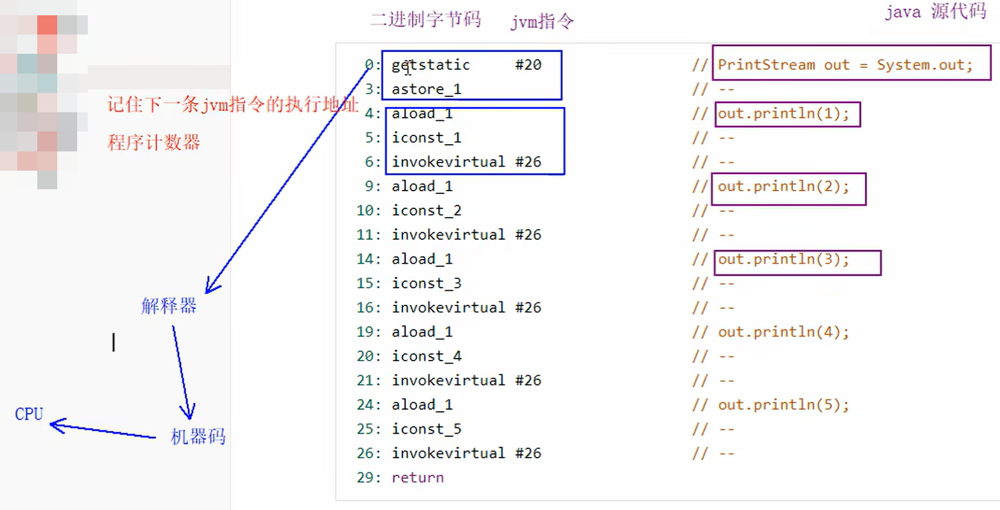

PC Register，Program Counter Register，程序计数器

## Java 中代码的执行流程

Java 代码首先被编译成字节码（JVM 指令），然后这些字节码交由 JVM 执行引擎的解释器进行解释。解释器将字节码转换为机器码，最终交由 CPU 执行。

## 程序计数器的作用

**负责记住下一条 JVM 指令的执行地址** -> 保证程序执行的有序性

负责记录下一条 JVM 指令的执行地址，从而确保程序执行的有序性。

每个线程都有自己的程序计数器，记录该线程上次执行结束的位置。当线程被调度时，程序计数器指示从上次停止的位置继续执行。

## 程序计数器的实现

程序计数器是通过“寄存器”实现的。寄存器是 CPU 中访问速度最快的存储单元，Java 将寄存器作为程序计数器来存储和读取指令的内存地址，因为指令的读取频率很高。

## 程序计数器的特点

- 线程私有
- **唯一一个不会存在内存溢出的内存结构**