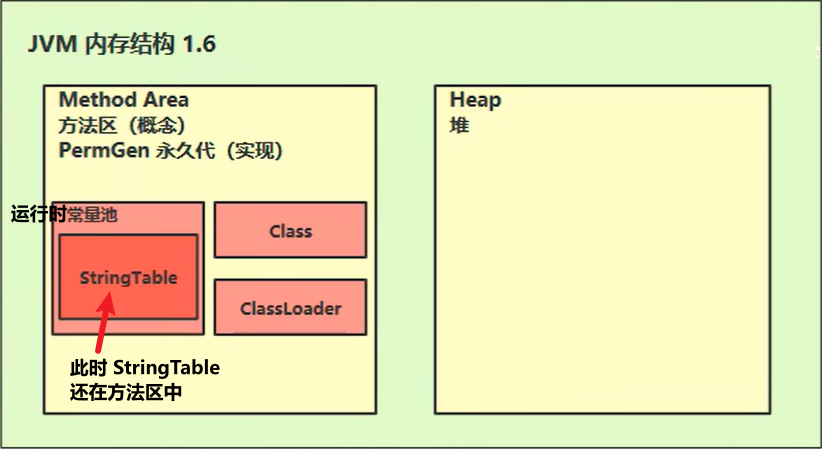
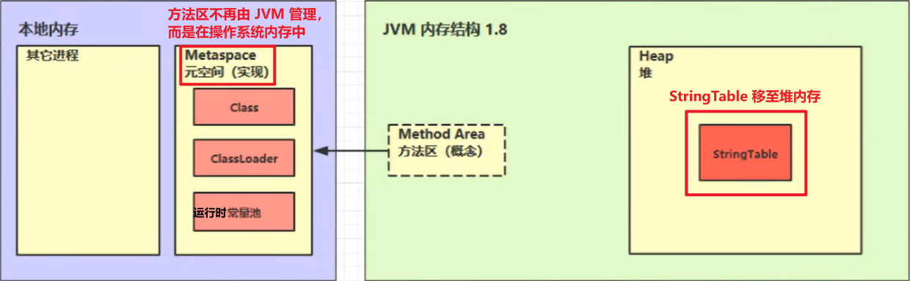

## 定义

方法区存储：

1. **类的二进制字节码数据**
2. **类加载器**
3. **运行时常量池**

注意：方法区不是堆的一部分，它与堆一样是所有线程共享的

## JDK 1.6

## JDK 1.8 及以后

## 核心理解

HotSpot 虚拟机：

JDK 1.8 之前，方法区的实现叫做**永久代**（使用堆的一部分内存作为方法区）；
JDK 1.8 及以后，移除了永久代，换了一种实现，叫做**元空间**（用的不是堆的内存了，而是本地内存，即操作系统的内存）

方法区只是一种**规范**，永久代和元空间都是它的一种**实现**。

JDK 1.8 之后的方法区不是由 JVM 来管理它的内存结构，因为使用的是本地操作系统的内存。