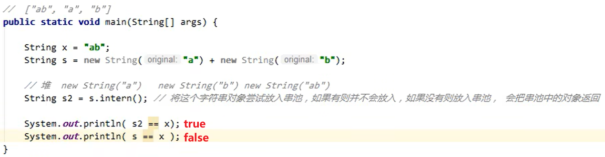

## StringTable

1. 数据结构
2. 位置
3. 垃圾回收
4. 调优

## 数据结构（略）

## JDK 1.8 vs JDK 1.6

### JDK 1.8 intern()

尝试将该字符串对象放入串池：如果有 -> 不放入；如果没有 -> 放入串池，**并把串池中的对象返回**




### JDK 1.6 intern()

尝试将该字符串对象放入串池，如果有 -> 不放入；如果没有 -> **拷贝一份，将新的字符串对象放入串池并返回**

即：使用 intern() 的字符串对象和最终放入串池中的对象是两个对象


## 面试题

1. JDK 1.8

(图)

2. JDK 1.8

(图)

3. JDK 1.6

(图)

## StringTable 的位置

JDK1.6 。。。，所以为了优化，JDK 1.7 之后将 StringTable 从方法区移到了推内存中 -> 堆内存中垃圾回收效率更高

垃圾回收的一个规则：

（TODO：补充）

## StringTable 垃圾回收

StringTable 底层是哈希表（HashTable？）数据结构实现的，当内存满了时触发垃圾回收

## StringTable 性能调优

主要就是调增（？）桶 bucket 的个数（哈希表数组个数/数组长度）

底层是哈希表实现的，哈希表的性能取决于它的大小：
桶的个数越多 -> 存放的元素越分散 -> 哈希冲突概率越小 -> 查找速度快

总结：

- **如果系统中的字符串常量非常多的话，可以将桶的个数设置大一些：```-XX: StringTableSize=桶的个数```**
- 考虑是否将字符串对象入池：intern()