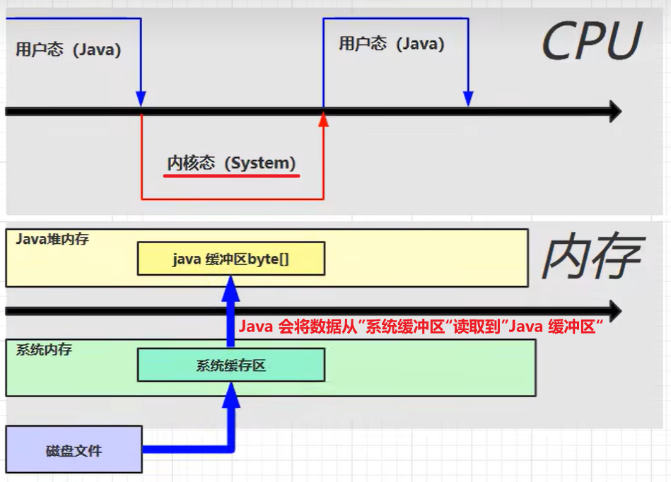
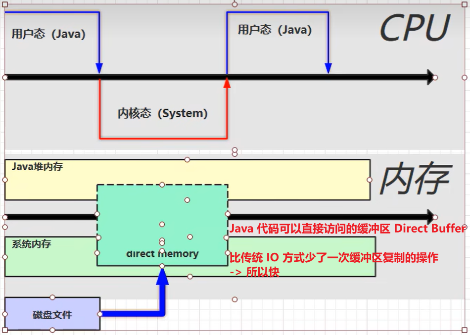
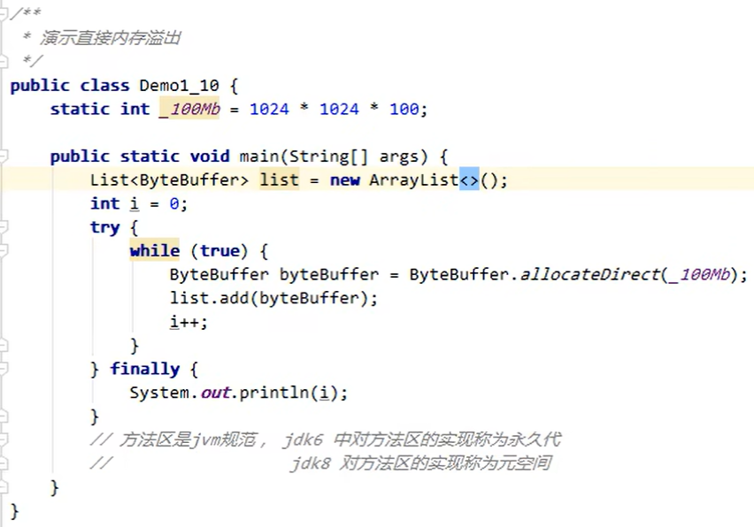
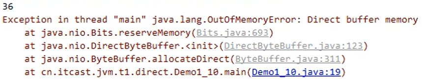

## 介绍

不属于 Java 虚拟机管理的内存，属于系统内存

Direct Memory 内存特点：

- 常见于 **NIO 操作时，用作数据缓冲区**
- 分配回收成本较高，但读写性能高
- 不受 JVM 内存回收管理

## 基本使用

为什么 Direct Buffer 比传统 IO 快？为什么本地内存读取更快？
-> 原理分析：

1. **传统 IO 的方式**：

Java 本身并不具备磁盘读写的能力，需要调用操作系统的函数来进行磁盘读写（即需要调用本地方法）。读取磁盘时会在操作系统中画出一块缓冲区，称为**系统缓冲区**，磁盘内容会先读取到系统缓冲区中，但 Java 代码在这里是不会运行的。JVM 会在堆内存中划分一块**Java 缓冲区**，然后再将数据从系统缓冲区读取到 Java
缓冲区。



2. **Direct Buffer 的方式**：

在操作系统中划分出一块操作系统和 Java 代码都可以共享的区域
-> 不需要先读到系统缓冲区后再读到 Java 缓冲区了，Java 代码可以直接读



## 内存溢出

Direct Memory 不受 JVM 内存回收管理 -> 不手动释放内存就会溢出

下面的例子中，在循环中不断申请一个 100 MB 的直接内存空间，把其加入 list 中，最终会抛出直接内存 OOM 异常：





## 释放原理

直接内存的释放是**通过一个 Unsafe 对象来管理的**，无法通过垃圾回收释放

（这个对象一般是 JDK 内部使用的）

ByteBuffer 的实现类内部：

- 使用了 Unsafe 对象完成直接内存的分配回收，并且回收需要主动调用 freeMemory 方法
- 使用了 **Cleaner(虚引用)** 来监测 ByteBuffer 对象，一旦 ByteBuffer 对象被垃圾回收，就会由 ReferenceHandler 线程通过 Cleaner 的 clean 方法调用 freeMemory 来释放内存

## 禁用显式回收对直接内存的影响

```-XX:+DisableExplicitGC```让代码中的 System.gc() 失效

这种方式会对直接内存的垃圾回收造成影响