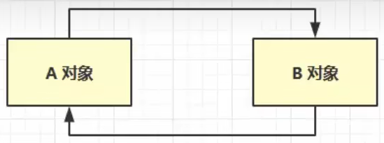

## 判断垃圾可被回收：引用计数法

当前对象被一个变量所引用，则该对象引用计数加一
当对象的引用计数为 0 时 -> 应该回收

缺陷：这种情况会导致内存泄漏

## 判断垃圾可被回收：可达性分析算法

这是 JVM 判断对象是否为垃圾的算法

一些根对象（GC Root）：一定不会被回收的对象
JVM 进行垃圾回收时，会先去堆中将所有对象扫描一遍，看是否能够沿着 GC Root 为起点的引用链找到该对象：如果找不到 -> 表示可以回收；如果找得到 -> 不回收

## 阅读扩展：对象的存活与毁灭（待优化）

要经历两次标记：

- 第一次标记：是否在 GC Root 的引用链上（是否可达）

（在对象被判断为不可达之后不会立即回收，还会有第二次标记）将第一次标记为需要回收的对象放入一个 F-Queue 队列中，然后让一个优先级较低的线程来调用队列中要回收的对象的 finalize()

- 第二次标记（对象的自救）

通过判断是否重写了 finalize() / 是否已经被调用过 finalize()，来决定是否还要调用该方法
-> 只有未被调用过 finalize() 的对象和重写了 finalize() 的对象才会调用该方法；否则第二次标记时还是会存在于 F-Queue 中

自救的方法：在调用该对象的 finalize() 时，在重写的该方法中将对象赋值给某个变量
-> 这样一来，在第二次标记时就会发现该对象存在于引用链上
-> 会从要回收的名单中剔除，即完成了自救

**注意：每个对象的 finalize() 只能被执行一次**

## 查看 GC Root 对象

可使用可视化工具查看