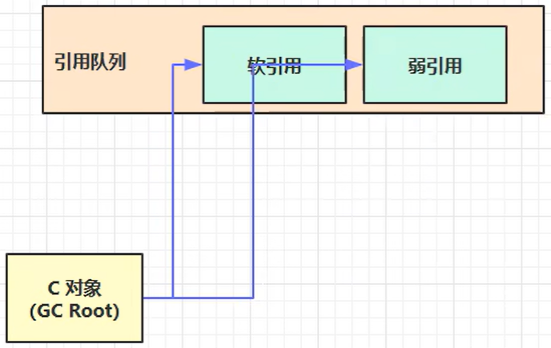
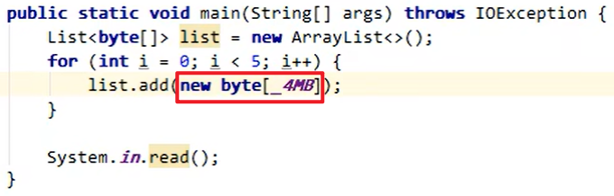
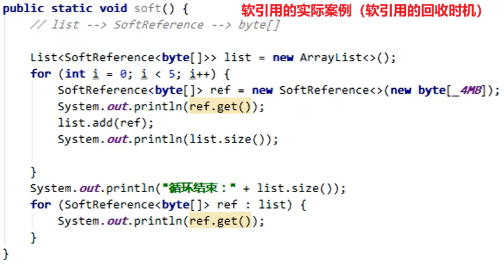
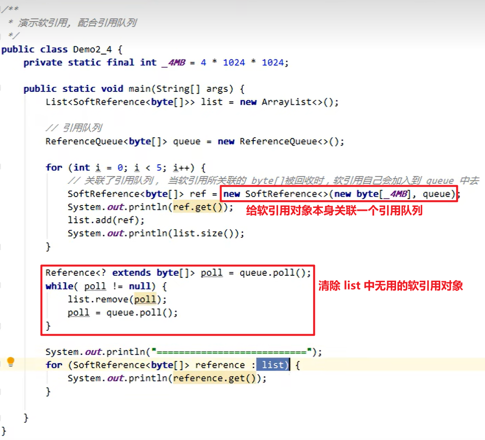

（目前记得有点乱，待整理）

## 介绍

1. Strong References (强引用)

当所有 GC Roots 对象都不通过强引用引用该对象，该对象才能被垃圾回收

2. Soft Reference (软引用)

- 当只有软引用引用该对象，并且在垃圾回收后内存仍不足时，才会再次触发垃圾回收，回收软引用对象
- 可以配合引用队列来释放软引用本身

3. Weak References (弱引用)

- 当只有软引用引用该对象时，在垃圾回收时无论内存是否充足，都会回收弱引用对象
- 可以配合引用队列来释放弱引用本身

4. Phantom References (虚引用)

必须配合引用队列使用，主要配合 ByteBuffer 使用，当被引用对象被回收时，会将虚引用入队，由 Reference Handler 线程调用虚引用相关方法释放直接内存

5. Final Reference (终结器引用)

无需手动编码，但其内部配合引用队列，在垃圾回收时终结器引用入队（被引用对象暂时没有被回收），再由 Finalizer 线程通过终结器引用找到被引用对象并调用它的 finalize()，第二次 GC 时才能回收被引用对象

## 强引用

平时 new 的都是强引用，只要能够沿着 GC Root 的引用链找到它，就不会被回收

没有 GC Root 直接/间接引用该对象了 -> 该对象会被回收

## 软引用

当垃圾回收且内存不足时 -> 该对象会被回收（前提是没有被某个强引用直接引用）

## 弱引用

当垃圾回收时，即使内存足够 -> 也会被回收掉（前提是没有被某个强引用直接引用）

## 软引用 & 弱引用


软引用和弱引用可以配合“引用队列”来使用，也可以不配合

“软引用”和“弱引用”本身也是对象，当它们引用的对象被回收后，它们就可以放到“引用队列”中去



## 软引用/弱引用的应用

案例：
很多图片资源，如果使用强引用引用这些图片资源 -> 容易发生内存溢出
改进：我们希望在内存紧张时，将这些资源占有的内存释放掉，等未来要使用时再读取一遍 -> 要使用软/弱引用

改进前：
List --> byte[]
（在 List 中直接强引用 byte[]）



改进后（通过软/弱引用）：
List ==> SoftReference/WeakReference --> byte[]
（在 List 中强引用一个软引用/若引用对象，软引用对象再引用一个 byte[]）



软引用/弱引用的对象只要没有被根对象强引用 -> 内存紧张触发垃圾回收时，它会被回收

## 软引用/弱引用结合引用队列

软引用引用的对象在内存紧张时被回收，我们希望将软引用对象本身也回收掉，因为软应用对象本身也是占用内存的

如何清理一个无用的软引用对象本身？
-> 需要使用引用队列来完成

如何关联软引用对象和引用队列？
-> 在创建软引用对象时，将引用队列作为参数传入



## 虚引用

**用来跟踪对象被垃圾回收的活动**

当虚引用对象创建时，就会关联一个引用队列
-> 可以再虚引用引用的对象被回收之前采取一定的措施
-> 虚引用的典型用法（释放直接内存）：在虚引用引用的对象被垃圾回收时，虚引用对象自己就会被放进引用队列，从而可以间接地用一个线程来调用虚引用对象的方法，调用 Unsafe.freeMemory() 来释放直接内存

## 虚引用 & 终结器引用

和软引用、弱引用不同，“虚引用”和“终结器引用”必须配合引用队列使用

同样地，虚引用、终结器引用本身都是对象

## 垃圾销毁的时机

finalize()：

1. 如果希望对象被垃圾回收时执行一段代码 -> 重写 finalize()
2. finalize() 可以完成对象的自救，判断一个对象是否可以被回收，需要两次标记，第一次是可达性分析标记，第二次就是分析这个要回收的对象是否调用过 finalize() / 是否重写了 finalize()：如果未调用过 / 重写了 -> JVM 会调用该对象的 finalize()，在该方法中，我们可以两件事：
    (1) 销毁资源
    (2) 对象自救（让某个强引用引用该对象）

一个对象的 finalize() 只会被调用一次，而且 finalize() 被调用不意味着 GC 会立即回收该对象 -> 有可能调用 finalize() 后，该对象又不需要被回收了，然而到了真正要被回收的时候，因为前面调用过一次而不会调用 finalize()，从而产生问题

## 类加载的时机

```Java
static {
    // 静态代码块执行
}
```