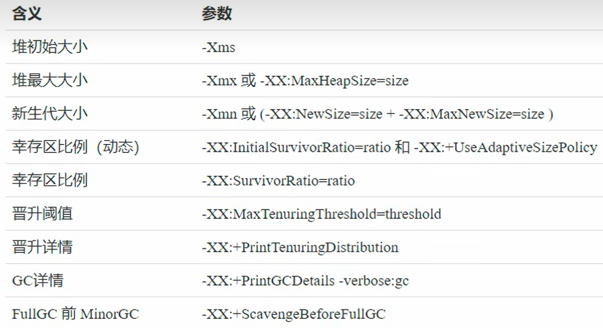
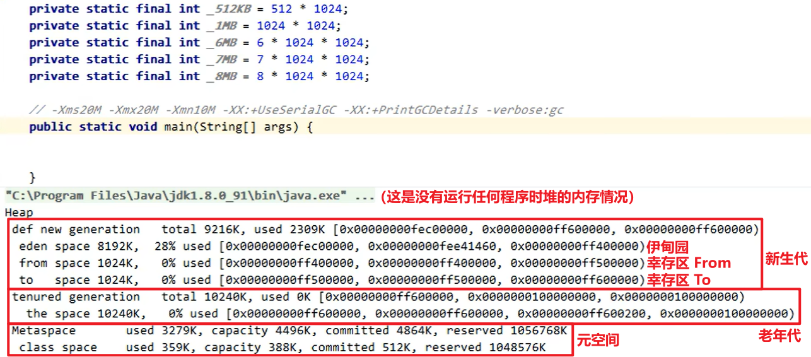

## 介绍

JVM 会结合上述三种算法协同工作，具体的实现叫做**分代的**垃圾回收机制

将堆内存划分为两大块：新生代（Young Generation）和老年代（Old Generation）

新生代又划分为：伊甸园（Eden）、幸存区 From、幸存区 To

Java 中有些对象长时间使用的放在老年代，有些用的时间短的放在新生代

根据 Java 对象生命周期的变化存放在不同的位置，并采取不同的垃圾回收策略

老年代中很久触发一次垃圾回收，而新生代垃圾回收的频率高一些

（TODO：补充图片）

## 如何工作的

Eden 中对象进行一次 GC 后存活下来的对象，寿命加一

**Minor GC 垃圾回收流程**：

开始创建的对象都会直接被存放到 Young Generation 的 Eden 中，当 Eden 的内存快满时 -> 触发一次 GC 垃圾回收。**新生代的垃圾回收一般称为 Minor GC**。

然后根据可达性分析算法，根据 GC Root 引用链去找哪些对象是没有的，哪些对象是有用的。对经过一次 GC 后存活下来的对象，使用复制算法放入到 Young Generation 的 To 中，并寿命加一；伊甸园中其他对象被直接清理掉。

交换 From 和 To 的指针（交换位置）

然后就可以继续向 Eden 中存放对象

第二次触发 Minor GC 时，会在 Eden 和 From 中根据可达性分析算法寻找需要被回收的垃圾，然后将存活下来的存放到 To 中，再交换 From 和 To 的位置

经历了一定次数的垃圾回收后，仍然在 From 中存活的对象会被放入 Old Generation（因为显然是有价值的）

**具体的晋升阈值取决于垃圾回收器**

老年代使用的内存达到一定阈值时，就会触发一次 **Full GC**（STW 时间更长）

Minor GC 会引发 STW，暂停其他用户线程，等垃圾回收结束后用户线程才恢复运行

如果 Full GC 后内存仍然不够用，会抛出 OutOfMemory 异常

（TODO：补充图片）

## GC 相关 VM 参数

## GC 分析

1. 读取垃圾回收的日志

Young Generation 的 From 中的对象不一定是数量达到阈值才会被放入 Old Generation，当 Young Generation 中的内存紧张时，也可能会被放入到 Old Generation

2. 大对象直接晋升到 Old Generation

整个大到放不下 Young Generation -> 会直接被放入老年代

3. Java 中某一个线程内发生了内存溢出异常，并不会导致整个 Java 进程的结束