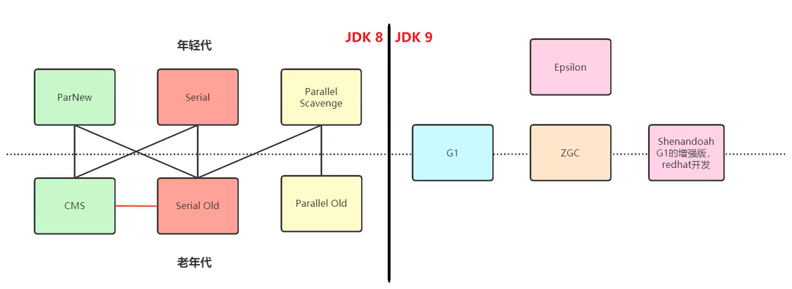

垃圾回收算法是方法论，垃圾回收器是方法论的实践者

## 分类

不同的垃圾回收器负责不同的区域，并采取不同的垃圾回收算法

1. 串行的垃圾回收器

单线程完成垃圾回收

堆内存较小，适合个人电脑

2. 并行的垃圾回收器（吞吐量优先）

多线程

适合堆内存较大的，需要多核 CPU

让单位时间内 STW 的时间最短

**垃圾回收时间低 -> 吞吐量高** 0.2s + 0.2s = 0.4s

3. 并发的垃圾回收器（响应时间优先）

多线程

适合堆内存较大的，需要多核 CPU

**尽可能让单次 STW 的时间最短** 0.1s + 0.1s + 0.1s + 0.1s + 0.1s = 0.5s

并发是指用户线程和垃圾回收线程可以同时执行

## 评估 GC 的性能指标

**吞吐量**：运行用户代码的时间 / 总运行时间
    （总运行时间 = 程序的运行时间 + 内存垃圾回收的时间）
垃圾回收的开销：垃圾回收所用时间 / 总运行时间
**暂停时间**：执行垃圾回收时，程序的工作线程被暂停的时间
回收频率：相对于应用程序的执行，回收操作发生的频率
**内存占用**：Java 堆区所占的内存大小
快速：一个对象从诞生到被回收所经历的时间

## 常用垃圾收集器

