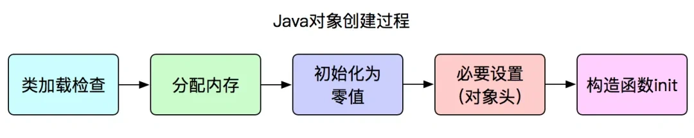
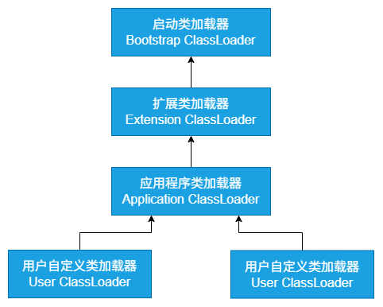
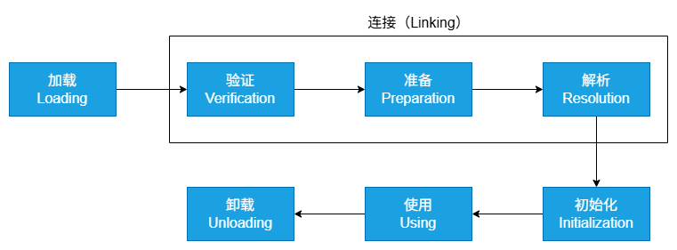

## 在 Java 中创建对象的过程

步骤如下：
1. **类加载检查**：JVM 遇到一条 new 指令时，先去检查这个指令的参数是否能在**常量池**中定位到一个**符号引用**，并检查这个符号引用代表的类**是否已被加载、解析、初始化过**：如果没有 -> 那么必须先执行相应的**类加载过程**。
2. **分配内存**：在类加载检查通过后，JVM 为新生对象分配内存。（**对象所需的内存大小在类加载完成后就可以确定**，为对象分配空间就是把一块确定大小的内存从 Java 堆中划分出来。）
3. **初始化零值**：内存分配完成后，JVM 需要将分配到的内存空间都初始化为零值（不包括对象头）-> 确保对象的实例字段在 Java 代码中可以不赋初始值就直接使用，程序能访问到这些字段的数据类型所对象的零值。
4. **进行必要设置，如对象头**：初始化零值完成后，JVM 要对对象进行必要的设置，如这个对象是哪个类的实例、如何才能找到类的元数据信息、对象的哈希码、对象的 GC 分代年龄等（这些信息存放在对象头中）。另外，根据 JVM 当前运行状态的不同，如是否启用偏向锁等，对象头会有不同的设置方式。
5. **执行 init()**：以上完成后，从 JVM 的视角来看，一个新对象已经产生了，但从 Java 程序的视角来看，对象创建才刚开始——因为构造函数（即 class 文件中的方法）还没有执行，所有字段都还为零，**对象需要的其他资源和状态信息**还没有按照预定的意图构造好。所以一般来说，执行 new 指令后会接着执行方法，把对象按照程序员的意愿进行初始化，这样一个真正可用的对象才算完全被构造出来。

## 对象的生命周期

包括三个阶段：创建->使用->销毁
* 创建：对象通过关键字 new 在堆内存中被实例化，构造函数被调用，对象的内存空间被分配。
* 使用：对象被引用并执行相应的操作，可以通过引用访问对象的属性和方法，在程序运行过程中被不断使用。
* 销毁：当对象不再被引用时，通过垃圾回收机制自动回收对象所占用的内存空间。垃圾回收器会在适当的时候检测并回收不再被引用的对象，释放对象占用的内存空间，完成对象的销毁过程。

## 类加载器有哪些

* Bootstrap Class Loader：最顶层的类加载器，负责加载 Java 的核心库（如位于 jre/lib/rt.jar 中的类），C++ 实现，是 JVM 的一部分。无法被 Java 程序直接引用。
* Extention Class Loader：Java 实现，继承自 ClassLoader 类，负责加载 Java 扩展目录（jre/lib/ext 或由系统变量 Java.ext.dirs 指定的目录）下的 jar 包和类库。扩展类加载器由启动类加载器加载，并且父接载其就是启动类加载器。
* System Class Loader/Application Class Loader：Java 实现，负责加载用户类路径（ClassPath）上的指定类库，是我们平时写 Java 程序时默认使用的类加载器。系统类加载器的父加载器是扩展类加载器。它可以通过 ClassLoader.getSystemClassLoader() 获取到。
* Custom Class Loader：开发者可以根据需求定制类的加载方式，如：从网络、数据库、甚至是加密文件中加载类。自定义类加载器可以用来扩展 Java 应用程序的灵活性、安全性，是 Java 动态性的一个重要体现。

这些类加载器之间的关系形成了双亲委派模型，核心思想是：当一个类加载器收到类加载的请求时，不会先自己尝试加载这个类，而是把这个请求委派给父类加载器去完成，每一层类加载器都是如此，因此所有加载请求最终都应该传递到顶层的启动类加载器中。只有当父加载器反馈自己无法完成这个加载请求时（它的搜索范围中没有找到所需的类），子加载器才会尝试自己加载。

## 双亲委派模型的作用

* **保证类的唯一性**：通过委托机制，确保所有加载请求都会传递到启动类加载器，避免不同类加载器重复加载相同类的情况，保证了 Java 核心类库的统一性，也防止了用户自定义类覆盖核心类库的可能。
* **保证安全性**：由于 Java 核心库被启动类加载器加载，而启动类加载器只加载信任的类路径中的类，这样可以防止不可信的类假冒核心类。例如，恶意代码无法自定义一个 Java.lang.Systen 类并加载到 JVM 中，因为这个请求会被委托给启动类加载器，而启动类加载器只会加载标准的 Java 库中的类。
* **支持隔离和层次划分**：支持不同层次的类加载器服务于不同的类加载需求，如应用程序类加载器加载用户代码，扩展类加载器加载扩展框架，启动类加载器加载核心库。这种层次化的划分有助于实现沙箱安全机制，保证了各个层级类加载器的职责清晰，也便于维护和扩展。
* **简化了加载流程**：通过委派，大部分类能够被正确的类加载器加载，减少了每个加载器需要处理的类的数量，简化了类的加载过程，提高了加载效率。

## 类加载的过程

* **加载**：通过类的全限定名（包名+类名），获取到该类的 .class 文件的二进制字节流，将二进制字节流所代表的静态存储结构转化为方法区运行时的数据结构，在内存中生成一个代表该类的 Java.lang.Class 对象，作为方法区这个类的各种数据的访问入口。
* **连接**：
  * **验证**：确保 class 文件中的字节流包含的信息符合当前 JVM 的要求，保证这个被加载的 class 类的正确性，避免危害到虚拟机的安全。验证阶段大致会完成以下四个阶段的检验动作：文件格式校验、元数据验证、字节码验证、符号引用验证。
  * **准备**：为类中的静态字段分配内存，并设置默认的初始值。被 final 修饰的 static 字段不会设置，因为 final 在编译时就分配了。
  * **解析**：JVM 将常量池的“符号引用”直接替换为“直接引用”的过程。
* **初始化**：是整个类加载过程的**最后一个阶段**，简单来说就是执行类的构造器方法，要注意的是这里的构造器方法并不是开发者写的，而是编译器自动生成的。
* **使用**：使用类或创建对象
* **卸载**：如果有以下情况，类就会被卸载：1. 该类所有的实例都已被回收，也就是 Java 堆中不存在该类的任何实例；2. 加载该类的 ClassLoader 已被回收；3. 该类对应的 Java.lang.Class 对象没有在任何地方被引用，无法在任何地方通过反射访问该类的方法。

[问题类的加载和双亲委派原则](https://xiaolincoding.com/interview/jvm.html#%E8%AE%B2%E4%B8%80%E4%B8%8B%E7%B1%BB%E7%9A%84%E5%8A%A0%E8%BD%BD%E5%92%8C%E5%8F%8C%E4%BA%B2%E5%A7%94%E6%B4%BE%E5%8E%9F%E5%88%99)

