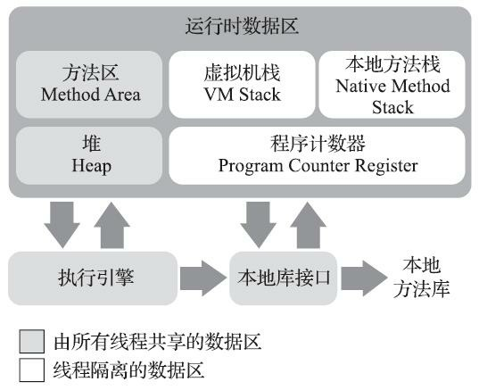
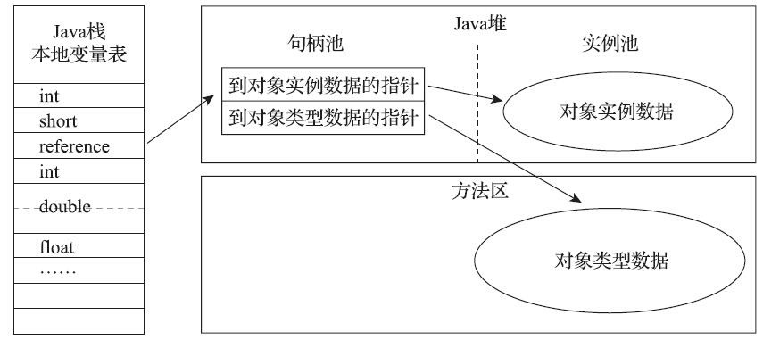
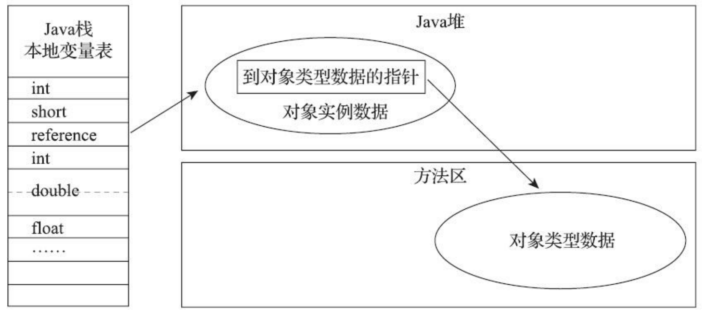

# 2 Java 内存区域与内存溢出异常

## 2.1 概述

## 2.2 运行时数据区域



### 2.2.1 程序计数器

Program Counter Register，是一块较小的内存空间，线程私有，可以看作是当前线程所执行的字节码的行号指示器。

字节码解释器工作时就是通过改变这个计数器的值来选取下一条需要执行的字节码指令，分支、循环、跳转、异常处理、线程恢复等基础功能都需要依赖这个计数器来完成。

如果线程：
    * 正在执行 Java 方法 -> 这个计数器记录的是正在执行的虚拟机字节码指令的地址
    * 正在执行 Native 方法 -> 这个计数器为空（Undefined）。

此内存区域是唯一一个在 Java 虚拟机规范中没有规定任何 OutOfMemoryError 情况的区域。

### 2.2.2 Java 虚拟机栈

Java Virtual Machine Stacks，线程私有，它的生命周期与线程相同。

描述的是 Java 方法执行的内存模型：每个方法在执行的同时都会创建一个栈帧（Stack Frame）用于存储局部变量表、操作数栈、动态链接、方法出口等信息。每一个方法从调用直至执行完成的过程，就对应着一个栈帧在虚拟机栈中入栈到出栈的过程。

局部变量表存放了编译器可知的八种基本数据类型、对象引用。其中 64 位长度的 long 和 double 类型的数据会占用 2 个局部变量空间（Slot），其余的数据类型只占用 1 个。局部变量表所需的内存空间在编译期间完成分配，当进入一个方法时，这个方法需要在栈帧中分配多大的局部变量空间是完全确定的，在方法运行期间不会改变局部变量表的大小。

规范中规定了两种异常状况：
1. StackOverFlowError：线程请求的栈深度大于虚拟机所允许的深度
2. OutOfMemoryError：虚拟机栈动态扩展时无法申请到足够的内存
注：HotSpot 虚拟机的实现是不支持扩展，所以除非在创建线程申请内存时就因无法获得足够内存而出现 OutOfMemoryError 异常，否则在线程运行时是不会因为扩展而导致内存溢出的，只会因为栈容量无法容纳新的栈帧而导致 StackOverflowError 异常。

### 2.2.3 本地方法栈

Native Method Stack，和虚拟机栈的区别不过是：虚拟机栈为 Java 方法服务；而本地方法栈是为 Native 方法服务。

可能出现的异常和虚拟机栈一样。

### 2.2.4 Java 堆

Java Heap，通常是 JVM 所管理的内存中最大的一块，被所有线程共享，在 JVM 启动时创建，它的唯一目的就是存放对象实例，几乎所有的对象实例都在这里分配内存。

> The heap is the runtime data area from which memory for all class instances and arrays is allocated.

如果在 Java 堆中没有内存完成实例分配，并且堆也无法再扩展时，JVM 将会抛出 OutOfMemoryError 异常。

### 2.2.5 方法区

Method Area，被所有线程共享，用于存储已被虚拟机加载的类信息、常量、静态变量、即时编译器编译后的代码等数据。

*规范把方法区描述为堆的一个逻辑部分*

当方法区无法满足内存分配需求时抛出 OutOfMemoryError

### 2.2.6 运行时常量池

Runtime Constant Pool，是方法区的一部分

Class 文件中除了有类的版本、字段、方法、接口等描述信息外，还有一项信息是常量池表（Constant Pool Table），用于存放编译器生成的各种字面量与符号引用，**这部分内容将在类加载后存放到方法区的运行时常量池中**。

相对于 Class 文件常量池的另一个重要特征是具备动态性，运行期间也可以将新的常量放入池中，这种特性被开发人员利用得比较多的就是 String 类的 intern()。

既然运行时常量池是方法区的一部分，自然受方法区内存的限制，当常量池无法再申请到内存时会抛出 OutOfMemoryError。

### 2.2.7 直接内存

Direct Memory，不是虚拟机运行时数据区的一部分，也不是规范中定义的内存区域。但是这部分内存也被频繁地使用，也可能导致 OutOfMemoryError。

## 2.3 HotSpot虚拟机对象探秘

### 2.3.1 对象的创建

当 JVM 遇到一条字节码 new 指令时，首先讲将去检查这个指令的参数是否能在常量池中定位到
一个类的符号引用，并且检查这个符号引用代表的类是否已被加载、解析和初始化过。如果没有 -> 那
必须先执行相应的类加载过程（在第7章详细讨论）。

类加载检查通过后，接下来虚拟机将为新生对象分配内存。对象所需内存的大小在类加载完成后便可完全确定（2.3.2），为对象分配空间的任务实际上便等同于把一块确定大小的内存块从Java堆中划分出来。

如何划分可用空间：
1. 指针碰撞（Bump The Pointer）：简单高效，使用 Serial、ParNew 等带 整理压缩（Compact）过程的收集器时
2. 空闲列表（Free List）：较为复杂，使用 CMS 这种基于清除（Sweep）算法的收集器时

对象创建的线程安全问题解决方案：
1. 对分配内存空间的动作进行同步处理——实际上 JVM 是采用 CAS+失败重试 的方式保证更新操作的原子性
2. 把内存分配的动作按照线程划分在不同的空间中进行，即每个线程在 Java 堆中预先分配一小块内存，称为本地线程分配缓冲（Thread Local Allocation Buffer，TLAB），哪个线程要分配内存，就在哪个线程的本地缓冲区中分配，只有本地缓冲区用完了，分配新的缓冲区才需要同步锁定。可以通过参数```-XX:+/-UseTLAB```配置。

内存分配完成后，JVM 必须将分配到的内存空间（但不包括对象头）都初始化为零值（如果
使用了TLAB的话，这一项工作也可以提前至TLAB分配时顺便进行）-> 保证了对象的实例字段
在 Java 代码中可以不赋初始值就直接使用

接下来，JVM 还要对对象进行必要的设置，例如这个对象是哪个类的实例、如何才能找到类的元数据信息、对象的哈希码（实际上会延后到真正调用 Object::hashCode() 时才计算）、对象的 GC 分代年龄等信息。这些信息存放在对象头（Object Header）中。根据 JVM 当前运行状态的不同，如是否启用偏向锁等，对象头会有不同的设置方式。

### 2.3.2 对象的内存布局

HotSpot 虚拟机中，对象在堆内存中的存储布局可以划分为三个部分：对象头（Header）、实例数据（Instance Data）、对齐填充（Padding）。

1. HotSpot 虚拟机的对象头包括两类信息。第一类是用于存储对象自身的运行时数据，如 HashCode、GC 分代年龄、锁状态标志、线程持有的锁、偏向线程 ID、偏向时间戳等，这部分数据称为 Mark Word，32 或 64 bits。第二类是类型指针，即对象指向它的类型元数据的指针，JVM 通过这个指针来确定该对象是哪个类的实例。
2. 实例数据部分是对象真正存储的有效信息。
3. 对齐填充：由于 HotSpot 虚拟机的自动内存管理系统要求对象起始地址必须是 8 bytes 的整数倍，即任何对象的大小都必须是 8 bytes 的整数倍。对象头部分已经被精心设计成正好是 8 bytes 的倍数（1 或 2 倍），因此如果对象实例数据部分没有对齐，就需要通过对齐填充来补全。

### 2.3.3 对象的访问定位

我们的 Java 程序会通过栈上的 reference 数据来操作堆上的具体对象，对象访问方式也是由虚拟机实现确定的，主流的访问方式主要有两种：
1. 使用句柄 -> Java 堆中可能会划分出一块内存来作为句柄池，reference 中存储的就是对象的句柄地址，而句柄中包含了对象实例数据与类型数据各自具体的地址信息，如下图：

2. 使用直接指针 -> Java 堆中对象的内存布局必须考虑如何放置类型数据的相关信息，reference 中存储的直接就是对象地址，如果只是访问对象本身的话就不需要多一次间接访问的开销，如下图：

这两种对象访问方式各有优势：
1. 使用句柄访问的最大好处就是 reference 中存储的是稳定句柄地址，在对象被移动（GC 时是非常普遍的）时只会改变句柄中的实例数据指针，而 reference 本身不需要被修改
2. 使用直接指针访问的最大好处就是速度更快，它节省了一次指针定位的时间开销，由于对象访问在 Java 中非常频繁，因此这类开销积少成多也是一项极为可观的执行成本

## 2.4 实战：OutOfMemoryError 异常

### 2.4.1 Java 堆溢出

将堆的最小值 -Xms 参数与最大值 -Xmx 参数设置为一样即可避免堆自动扩展

参数 -XX:+HeapDumpOnOutOfMemoryError 可以让 JVM 在出现 OutOfMemoryError 异常时 Dump 出当前的内存堆转储快照以便事后进行分析（详见第 4 章）

当出现 Java 堆内存溢出时，异常堆栈信息```java.lang.OutOfMemoryError```会跟随进一步提示```Java heap space```。要解决这个区域的异常，常规的处理方法是先通过内存映像分析工具对 Dump 出来的堆转储快照进行分析，重点是确认内存中的对象是否是必要的，即要先分清楚到底是出现了内存泄漏（Memory Leak）还是内存溢出（Memory Overflow）。

* 如果是内存泄漏 -> 可进一步通过工具查看泄漏对象到 GC Roots 的引用链，找到泄漏对象是通过怎样的引用路径、与哪些 GC Roots 相关联，才导致垃圾收集器无法回收它们，根据泄漏对象的类型信息以及它到 GC Roots 引用链的信息，一般可以比较准确地定位到这些对象创建的位置，进而找出产生内存泄漏的代码的具体位置。
* 如果不是内存泄漏，即内存中的对象确实都是必须存活的 -> 应当检查 JVM 的堆参数（-Xmx 与 -Xms）设置，与机器的内存对比，看是否还有向上调整的空间。再从代码上检查是否存在某些对象生命周期过长、持有状态时间过长、存储结构设计不合理等情况，尽量减少程序运行期的内存消耗。
以上是处理Java堆内存问题的简略思路（关于堆转储快照文件分析方面的内容详见第 4 章）

### 2.4.2 虚拟机栈和本地方法栈溢出

### 2.4.3 方法区和运行时常量池溢出

注：自 JDK 7 起，原本存放在永久代的字符串常量池被移至 Java 堆中

### 2.4.4 本机直接内存溢出

参数```-XX:MaxDirectMemorySize```，如果不指定 -> 默认与 Java 堆最大值（由 -Xmx 指定）一致

# 3 垃圾收集器与内存分配策略

## 3.1 概述

Garbage Collection，GC

Java 堆和方法区这两个区域有着很显著的不确定性：一个接口的多个实现类需要的内存可能会不一样，一个方法所执行的不同条件分支所需要的内存也可能不一样，只有处于运行期间，我们才能知道程序究竟会创建哪些对象，创建多少个对象，这部分内存的分配和回收是动态的。垃圾收集器所关注的正是这部分内存该如何管理。

## 3.2 对象已死？

### 3.2.1 引用计数算法

Reference Counting

### 3.2.2 可达性分析算法

Reachability Analysis

引用链（Reference Chain）

在 Java 技术体系中固定可作为 GC Roots 的对象包括以下几种：
* 虚拟机栈（栈帧中的本地变量表）中引用的对象，如：各个线程被调用的方法堆栈中使用到的参数、局部变量、临时变量等
* 方法区中类静态属性引用的对象，如 Java 类的引用类型静态变量
* 方法区中常量引用的对象，如字符串常量池（String Table）中的引用
* 本地方法栈中 JNI（即通常所说的 Native 方法）引用的对象
* JVM 内部的引用，如基本数据类型对应的 Class 对象，一些常驻的异常对象（如 NullPointException、OutOfMemoryError）等，还有系统类加载器
* 所有被同步锁（synchronized 关键字）持有的对象
* 反映 JVM 内部情况的 JMXBean、JVMTI 中注册的回调、本地代码缓存等*（暂时不知道是什么）*

### 3.2.3 再谈引用

四种引用类型（强度依次逐渐减弱）：
* Strong Reference (强引用)
* Soft Reference (软引用)：在系统将要发生内存溢出异常前把这些对象列进回收范围之中进行第二次回收，如果这次回收还没有足够的内存，才会抛出内存溢出异常。
* Weak Reference (弱引用)：只能生存到下一次垃圾收集发生为止。当垃圾收集器开始工作，无论当前内存是否足够，都会回收掉只被弱引用关联的对象。
* Phantom Reference (虚引用)：一个对象是否有虚引用的存在，完全不会对其生存时间构成影响，也无法通过虚引用来取得一个对象实例。为一个对象设置虚引用关联的唯一目的只是为了能在这个对象被收集器回收时收到一个系统通知。

### 3.2.4 生存还是死亡？

至少要经历两次标记过程：
如果对象在可达性分析后发现没有与 GC Roots 相连的引用链
-> 被**第一次标记**，随后进行一次筛选，筛选的条件是此对象是否有必要执行 finalize()。

如果对象没有覆盖 finalize() 或 finalize() 已经被虚拟机调用过
-> 虚拟机将这两种情况都视为“没有必要执行”。

如果这个对象被判定为有必要执行 finalize() -> 该对象会被放置在一个名为 F-Queue 的队列中，并在稍后由一条由 JVM 自动建立的、低调度优先级的 Finalizer 线程去执行它们的 finalize()。这里所说的“执行”是指 JVM 会触发这个方法开始运行，但并不承诺一定会等待它运行结束。这样做的原因：如果某个对象的 finalize() 执行缓慢，或更极端地，发生了死循环，将很可能导致 F-Queue 中的其他对象永久处于等待，甚至导致整个内存回收子系统的崩溃。**finalize() 是对象逃脱死亡的最后一次机会，稍后收集器将对 F-Queue 中的对象进行第二次小规模的标记**，如果对象要在 finalize() 中成功自救，只要重新与引用链上的任何一个对象建立关联即可，如把自己（this 关键字）赋值给某个类变量或对象的成员变量 -> 在第二次标记时它将被移出“即将回收”的集合；如果对象这时还没逃脱 -> 基本上它就真的要被回收了。

