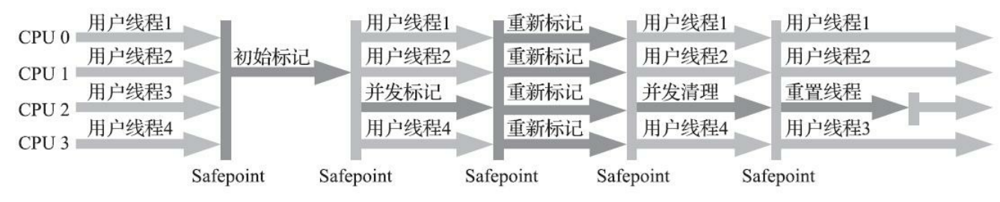

# 2 Java 内存区域与内存溢出异常

## 2.1 概述

## 2.2 运行时数据区域


### 2.2.1 程序计数器

Program Counter Register，是一块较小的内存空间，线程私有，可以看作是当前线程所执行的字节码的行号指示器。

字节码解释器工作时就是通过改变这个计数器的值来选取下一条需要执行的字节码指令，分支、循环、跳转、异常处理、线程恢复等基础功能都需要依赖这个计数器来完成。

如果线程：
    * 正在执行 Java 方法 -> 这个计数器记录的是正在执行的虚拟机字节码指令的地址
    * 正在执行 Native 方法 -> 这个计数器为空（Undefined）。

此内存区域是唯一一个在 Java 虚拟机规范中没有规定任何 OutOfMemoryError 情况的区域。

### 2.2.2 Java 虚拟机栈

Java Virtual Machine Stacks，线程私有，它的生命周期与线程相同。

描述的是 Java 方法执行的内存模型：每个方法在执行的同时都会创建一个栈帧（Stack Frame）用于存储局部变量表、操作数栈、动态链接、方法出口等信息。每一个方法从调用直至执行完成的过程，就对应着一个栈帧在虚拟机栈中入栈到出栈的过程。

局部变量表存放了编译器可知的八种基本数据类型、对象引用。其中 64 位长度的 long 和 double 类型的数据会占用 2 个局部变量空间（Slot），其余的数据类型只占用 1 个。局部变量表所需的内存空间在编译期间完成分配，当进入一个方法时，这个方法需要在栈帧中分配多大的局部变量空间是完全确定的，在方法运行期间不会改变局部变量表的大小。

规范中规定了两种异常状况：
1. StackOverFlowError：线程请求的栈深度大于虚拟机所允许的深度
2. OutOfMemoryError：虚拟机栈动态扩展时无法申请到足够的内存
注：HotSpot 虚拟机的实现是不支持扩展，所以除非在创建线程申请内存时就因无法获得足够内存而出现 OutOfMemoryError 异常，否则在线程运行时是不会因为扩展而导致内存溢出的，只会因为栈容量无法容纳新的栈帧而导致 StackOverflowError 异常。

### 2.2.3 本地方法栈

Native Method Stack，和虚拟机栈的区别不过是：虚拟机栈为 Java 方法服务；而本地方法栈是为 Native 方法服务。

可能出现的异常和虚拟机栈一样。

### 2.2.4 Java 堆

Java Heap，通常是 JVM 所管理的内存中最大的一块，被所有线程共享，在 JVM 启动时创建，它的唯一目的就是存放对象实例，几乎所有的对象实例都在这里分配内存。

> The heap is the runtime data area from which memory for all class instances and arrays is allocated.

如果在 Java 堆中没有内存完成实例分配，并且堆也无法再扩展时，JVM 将会抛出 OutOfMemoryError 异常。

### 2.2.5 方法区

Method Area，被所有线程共享，用于存储已被虚拟机加载的类信息、常量、静态变量、即时编译器编译后的代码等数据。

*规范把方法区描述为堆的一个逻辑部分*

当方法区无法满足内存分配需求时抛出 OutOfMemoryError

### 2.2.6 运行时常量池

Runtime Constant Pool，是方法区的一部分

Class 文件中除了有类的版本、字段、方法、接口等描述信息外，还有一项信息是常量池表（Constant Pool Table），用于存放编译器生成的各种字面量与符号引用，**这部分内容将在类加载后存放到方法区的运行时常量池中**。

相对于 Class 文件常量池的另一个重要特征是具备动态性，运行期间也可以将新的常量放入池中，这种特性被开发人员利用得比较多的就是 String 类的 intern()。

既然运行时常量池是方法区的一部分，自然受方法区内存的限制，当常量池无法再申请到内存时会抛出 OutOfMemoryError。

### 2.2.7 直接内存

Direct Memory，不是虚拟机运行时数据区的一部分，也不是规范中定义的内存区域。但是这部分内存也被频繁地使用，也可能导致 OutOfMemoryError。

## 2.3 HotSpot虚拟机对象探秘

### 2.3.1 对象的创建

当 JVM 遇到一条字节码 new 指令时，首先讲将去检查这个指令的参数是否能在常量池中定位到
一个类的符号引用，并且检查这个符号引用代表的类是否已被加载、解析和初始化过。如果没有 -> 那
必须先执行相应的类加载过程（在第7章详细讨论）。

类加载检查通过后，接下来虚拟机将为新生对象分配内存。对象所需内存的大小在类加载完成后便可完全确定（2.3.2），为对象分配空间的任务实际上便等同于把一块确定大小的内存块从Java堆中划分出来。

如何划分可用空间：
1. 指针碰撞（Bump The Pointer）：简单高效，使用 Serial、ParNew 等带 整理压缩（Compact）过程的收集器时
2. 空闲列表（Free List）：较为复杂，使用 CMS 这种基于清除（Sweep）算法的收集器时

对象创建的线程安全问题解决方案：
1. 对分配内存空间的动作进行同步处理——实际上 JVM 是采用 CAS+失败重试 的方式保证更新操作的原子性
2. 把内存分配的动作按照线程划分在不同的空间中进行，即每个线程在 Java 堆中预先分配一小块内存，称为本地线程分配缓冲（Thread Local Allocation Buffer，TLAB），哪个线程要分配内存，就在哪个线程的本地缓冲区中分配，只有本地缓冲区用完了，分配新的缓冲区才需要同步锁定。可以通过参数```-XX:+/-UseTLAB```配置。

内存分配完成后，JVM 必须将分配到的内存空间（但不包括对象头）都初始化为零值（如果
使用了TLAB的话，这一项工作也可以提前至TLAB分配时顺便进行）-> 保证了对象的实例字段
在 Java 代码中可以不赋初始值就直接使用

接下来，JVM 还要对对象进行必要的设置，例如这个对象是哪个类的实例、如何才能找到类的元数据信息、对象的哈希码（实际上会延后到真正调用 Object::hashCode() 时才计算）、对象的 GC 分代年龄等信息。这些信息存放在对象头（Object Header）中。根据 JVM 当前运行状态的不同，如是否启用偏向锁等，对象头会有不同的设置方式。

### 2.3.2 对象的内存布局

HotSpot 虚拟机中，对象在堆内存中的存储布局可以划分为三个部分：对象头（Header）、实例数据（Instance Data）、对齐填充（Padding）。

1. HotSpot 虚拟机的**对象头**包括两类信息。第一类是用于存储**对象自身的运行时数据，如 HashCode、GC 分代年龄、锁状态标志、线程持有的锁、偏向线程 ID、偏向时间戳**等，这部分数据称为 Mark Word，32 或 64 bits。第二类是**类型指针**，即对象指向它的类型元数据的指针，JVM 通过这个指针来确定该对象是哪个类的实例。
2. **实例数据**部分是对象真正存储的有效信息。
3. **对齐填充**：由于 HotSpot 虚拟机的自动内存管理系统要求对象起始地址必须是 8 bytes 的整数倍，即任何对象的大小都必须是 8 bytes 的整数倍。对象头部分已经被精心设计成正好是 8 bytes 的倍数（1 或 2 倍），因此如果对象实例数据部分没有对齐，就需要通过对齐填充来补全。

### 2.3.3 对象的访问定位

我们的 Java 程序会通过栈上的 reference 数据来操作堆上的具体对象，对象访问方式也是由虚拟机实现确定的，主流的访问方式主要有两种：
1. 使用句柄 -> Java 堆中可能会划分出一块内存来作为句柄池，reference 中存储的就是对象的句柄地址，而句柄中包含了对象实例数据与类型数据各自具体的地址信息，如下图：

2. 使用直接指针 -> Java 堆中对象的内存布局必须考虑如何放置类型数据的相关信息，reference 中存储的直接就是对象地址，如果只是访问对象本身的话就不需要多一次间接访问的开销，如下图：

这两种对象访问方式各有优势：
1. 使用句柄访问的最大好处就是 reference 中存储的是稳定句柄地址，在对象被移动（GC 时是非常普遍的）时只会改变句柄中的实例数据指针，而 reference 本身不需要被修改
2. 使用直接指针访问的最大好处就是速度更快，它节省了一次指针定位的时间开销，由于对象访问在 Java 中非常频繁，因此这类开销积少成多也是一项极为可观的执行成本

## 2.4 实战：OutOfMemoryError 异常

### 2.4.1 Java 堆溢出

将堆的最小值 -Xms 参数与最大值 -Xmx 参数设置为一样即可避免堆自动扩展

参数 -XX:+HeapDumpOnOutOfMemoryError 可以让 JVM 在出现 OutOfMemoryError 异常时 Dump 出当前的内存堆转储快照以便事后进行分析（详见第 4 章）

当出现 Java 堆内存溢出时，异常堆栈信息```java.lang.OutOfMemoryError```会跟随进一步提示```Java heap space```。要解决这个区域的异常，常规的处理方法是先通过内存映像分析工具对 Dump 出来的堆转储快照进行分析，重点是确认内存中的对象是否是必要的，即要先分清楚到底是出现了内存泄漏（Memory Leak）还是内存溢出（Memory Overflow）。

* 如果是内存泄漏 -> 可进一步通过工具查看泄漏对象到 GC Roots 的引用链，找到泄漏对象是通过怎样的引用路径、与哪些 GC Roots 相关联，才导致垃圾收集器无法回收它们，根据泄漏对象的类型信息以及它到 GC Roots 引用链的信息，一般可以比较准确地定位到这些对象创建的位置，进而找出产生内存泄漏的代码的具体位置。
* 如果不是内存泄漏，即内存中的对象确实都是必须存活的 -> 应当检查 JVM 的堆参数（-Xmx 与 -Xms）设置，与机器的内存对比，看是否还有向上调整的空间。再从代码上检查是否存在某些对象生命周期过长、持有状态时间过长、存储结构设计不合理等情况，尽量减少程序运行期的内存消耗。
以上是处理Java堆内存问题的简略思路（关于堆转储快照文件分析方面的内容详见第 4 章）

### 2.4.2 虚拟机栈和本地方法栈溢出

### 2.4.3 方法区和运行时常量池溢出

注：自 JDK 7 起，原本存放在永久代的字符串常量池被移至 Java 堆中

### 2.4.4 本机直接内存溢出

参数```-XX:MaxDirectMemorySize```，如果不指定 -> 默认与 Java 堆最大值（由 -Xmx 指定）一致

# 3 垃圾收集器与内存分配策略

## 3.1 概述

Garbage Collection，GC

Java 堆和方法区这两个区域有着很显著的不确定性：一个接口的多个实现类需要的内存可能会不一样，一个方法所执行的不同条件分支所需要的内存也可能不一样，只有处于运行期间，我们才能知道程序究竟会创建哪些对象，创建多少个对象，这部分内存的分配和回收是动态的。垃圾收集器所关注的正是这部分内存该如何管理。

## 3.2 对象已死？

### 3.2.1 引用计数算法

Reference Counting

### 3.2.2 可达性分析算法

Reachability Analysis

引用链（Reference Chain）

在 Java 技术体系中固定可作为 GC Roots 的对象包括以下几种：
* 虚拟机栈（栈帧中的本地变量表）中引用的对象，如：各个线程被调用的方法堆栈中使用到的参数、局部变量、临时变量等
* 方法区中类静态属性引用的对象，如 Java 类的引用类型静态变量
* 方法区中常量引用的对象，如字符串常量池（String Table）中的引用
* 本地方法栈中 JNI（即通常所说的 Native 方法）引用的对象
* JVM 内部的引用，如基本数据类型对应的 Class 对象，一些常驻的异常对象（如 NullPointException、OutOfMemoryError）等，还有系统类加载器
* 所有被同步锁（synchronized 关键字）持有的对象
* 反映 JVM 内部情况的 JMXBean、JVMTI 中注册的回调、本地代码缓存等*（暂时不知道是什么）*

### 3.2.3 再谈引用

四种引用类型（强度依次逐渐减弱）：
* Strong Reference (强引用)
* Soft Reference (软引用)：在系统将要发生内存溢出异常前把这些对象列进回收范围之中进行第二次回收，如果这次回收还没有足够的内存，才会抛出内存溢出异常。
* Weak Reference (弱引用)：只能生存到下一次垃圾收集发生为止。当垃圾收集器开始工作，无论当前内存是否足够，都会回收掉只被弱引用关联的对象。
* Phantom Reference (虚引用)：一个对象是否有虚引用的存在，完全不会对其生存时间构成影响，也无法通过虚引用来取得一个对象实例。为一个对象设置虚引用关联的唯一目的只是为了能在这个对象被收集器回收时收到一个系统通知。

### 3.2.4 生存还是死亡？

至少要经历两次标记过程：
如果对象在可达性分析后发现没有与 GC Roots 相连的引用链
-> 被**第一次标记**，随后进行一次筛选，筛选的条件是此对象是否有必要执行 finalize()。

如果对象没有覆盖 finalize() 或 finalize() 已经被虚拟机调用过
-> 虚拟机将这两种情况都视为“没有必要执行”。

如果这个对象被判定为有必要执行 finalize() -> 该对象会被放置在一个名为 F-Queue 的队列中，并在稍后由一条由 JVM 自动建立的、低调度优先级的 Finalizer 线程去执行它们的 finalize()。这里所说的“执行”是指 JVM 会触发这个方法开始运行，但并不承诺一定会等待它运行结束。这样做的原因：如果某个对象的 finalize() 执行缓慢，或更极端地，发生了死循环，将很可能导致 F-Queue 中的其他对象永久处于等待，甚至导致整个内存回收子系统的崩溃。**finalize() 是对象逃脱死亡的最后一次机会，稍后收集器将对 F-Queue 中的对象进行第二次小规模的标记**，如果对象要在 finalize() 中成功自救，只要重新与引用链上的任何一个对象建立关联即可，如把自己（this 关键字）赋值给某个类变量或对象的成员变量 -> 在第二次标记时它将被移出“即将回收”的集合；如果对象这时还没逃脱 -> 基本上它就真的要被回收了。

finalize() 已被官方明确声明为不推荐使用的语法

### 3.2.5 回收方法区

方法区的垃圾收集主要回收两部分内容：废弃的常量、不再使用的类型。

回收废弃常量与回收 Java 堆中的对象非常类似。

判定一个类型是否属于不再被使用的类，需要同时满足下面三个条件：
* 该类所有的实例都已经被回收，也就是 Java 堆中不存在该类及其任何派生子类的实例
* 加载该类的类加载器已经被回收（除非是经过精心设计的可替换类加载器的场景，否则通常是很难达成的）
* 该类对应的 java.lang.Class 对象没有在任何地方被引用，无法在任何地方通过反射访问该类的方法

## 3.3 垃圾收集算法

从如何判定对象消亡的角度出发，垃圾收集算法可以划分为两大类：
* 引用计数式垃圾收集（Reference Counting GC）
* 追踪式垃圾收集（Tracing GC）（本节介绍的所有算法均属于这个范畴）

### 3.2.1 分代收集理论

Generational Collection

是一套经验法则，建立在两个分代假说之上：
1. 弱分代假说（Weak Generational Hypothesis）：绝大多数对象都是朝生夕灭的。
2. 强分代假说（Strong Generational Hypothesis）：熬过越多次垃圾收集过程的对象就越难以消亡。

Young Generation    Old Generation

需要对分代收集理论添加第三条经验法则：
3. 跨代引用假说（Intergenerational Reference Hypothesis）：跨代引用相对于同代引用来说仅占极少数。

这其实是可根据前两条假说逻辑推理得出的隐含推论：存在互相引用关系的两个对象，是应该倾向于同时生存或同时消亡的。-> 我们不应再为了少量的跨代引用去扫描整个老年代，也不必浪费空间专门记录每一个对象是否存在及存在哪些跨代引用，只需在新生代上建立一个全局的数据结构——记忆集（Remembered Set），这个结构把老年代划分成若干小块，标识出老年代的哪一块内存会存在跨代引用。此后当发生 Minor GC 时，只有包含了跨代引用的小块内存里的对象才会被加入到 GC Roots 进行扫描。-> 避免把整个老年代加进GC Roots扫描范围。

虽然这种方法需要在对象改变引用关系时维护记录数据的正确性，会增加一些运行时的开销，但比起收集时扫描整个老年代来说仍然是划算的。

* 部分收集（Partial GC）：
    * 新生代收集（Minor GC/Young GC）
    * 老年代收集（Major GC/Old GC）（目前只有 CMS 收集器会有单独收集老年代的行为）
    * 混合收集（Mixed GC）：收集整个新生代和部分老年代的垃圾（目前只有 G1 收集器会有这种行为）
* 整堆收集（Full GC）：收集整个 Java 堆和方法区的垃圾

### 3.2.2 标记-清除算法

Mark-Sweep

缺点有两个：
1. 执行效率不稳定，如果 Java 堆中包含大量对象，而且其中大部分是需要被回收的，这时必须进行大量标记和清除的动作，导致标记和清除两个过程的执行效率都随对象数量增长而降低
2. 内存空间的碎片化问题，标记、清除之后会产生大量不连续的内存碎片，空间碎片太多可能会导致当以后在程序运行过程中需要分配较大对象时无法找到足够的连续内存而不得不提前触发另一次垃圾收集动作。

### 3.2.3 标记-复制算法

常被简称为复制算法

半区复制（Semispace Copying）

分配担保（Handle Promotion）

### 3.2.4 标记-整理算法

Mark-Compact

Stop The World

## 3.4 HotSpot 的算法细节实现

### 3.4.1 根节点枚举

在 HotSpot 的解决方案里，使用一组称为 **OopMap** 的数据结构，一旦类加载动作完成，HotSpot 就会把**对象内什么偏移量上是什么类型的数据**计算出来，在即时编译过程中，也会**在特定的位置记录下栈里和寄存器里哪些位置是引用**。这样收集器在扫描时就可以直接得知这些信息了，并不需要一个不漏地从方法区等 GC Roots 开始查找。*（暂时不太理解）*

### 3.4.2 安全点

Safepoint

安全点的选定既不能太少以至于让收集器等待时间过长，也不能太过频繁以至于过分增大运行时的内存负荷。安全点位置的选取基本上是以“是否具有让程序长时间执行的特征”为标准进行选定的。

另外一个需要考虑的问题是，如何在垃圾收集发生时让所有线程（不包括执行 JNI 调用的线程）都跑到最近的安全点，然后停顿下来。有两种方案可供选择：
1. 抢先式中断（Preemptive Suspension）：不需要线程的执行代码主动去配合，在垃圾收集发生时，系统首先把所有用户线程全部中断，如果发现有用户线程中断的地方不在安全点上，就恢复这条线程执行，让它一会再重新中断，直到跑到安全点上。（现在几乎没有虚拟机实现采用抢先式中断来暂停线程响应 GC 事件）
2. 主动式中断（Voluntary Suspension）：当垃圾收集需要中断线程时，不直接对线程操作，仅仅简单地设置一个标志位，各个线程执行过程时会不停地主动去轮询这个标志，一旦发现中断标志为真时就自己在最近的安全点上主动中断挂起。轮询标志的地方和安全点是重合的，另外还要加上所有创建对象和其他需要在 Java 堆上分配内存的地方，这是为了检查是否即将要发生垃圾收集，避免没有足够内存分配新对象。
*（暂时不太理解）*

### 3.4.3 安全区域

Safe Region

安全区域是指能够确保在某一段代码片段之中，引用关系不会发生变化，因此在这个区域中任
意地方开始垃圾收集都是安全的。我们也可以把安全区域看作被扩展拉伸了的安全点。

当用户线程执行到安全区域里面的代码时，首先会标识自己已经进入了安全区域，那样当这段时间里虚拟机要发起垃圾收集时就不必去管这些已声明自己在安全区域内的线程了。当线程要离开安全区域时，它要检查虚拟机是否已经完成了根节点枚举（或者垃圾收集过程中其他需要暂停用户线程的阶段）:如果完成了 -> 那线程就当作没事发生过，继续执行；否则 -> 就必须一直等待，直到收到可以离开安全区域的信号为止。

*（暂时不太理解）*

### 3.4.4 记忆集与卡表

（如何使用记忆集来缩减 GC Roots 扫描范围的问题）

目前最常用的一种记忆集实现形式：卡表

卡表与卡页对应示意图：


一个卡页的内存中通常包含不止一个对象，只要卡页内有一个（或更多）对象的字段存在着跨代指针，那就将对应卡表的数组元素的值标识为 1，称为这个元素变脏（Dirty），没有则标识为 0。在垃圾收集发生时，只要筛选出卡表中变脏的元素，就能轻易得出哪些卡页内存块中包含跨代指针，把它们加入 GC Roots 中一并扫描。、

### 3.4.5 写屏障

Write Barrier

（卡表元素如何维护的问题）

写屏障可以看作在虚拟机层面对“引用类型字段赋值”这个动作的 AOP 切面，在引用对象赋值时会产生一个环形（Around）通知，供程序执行额外的动作，即赋值的前后都在写屏障的覆盖范畴内。在赋值前的部分叫写前屏障（Pre-Write Barrier），在赋值后的部分叫写后屏障（Post-Write Barrier）。

除了写屏障的开销外，卡表在高并发场景下还面临着**伪共享（False Sharing）**问题。

参数```-XX：+UseCondCardMark```用来决定是否开启卡表更新的条件判断。开启会增加一次额外判断的开销，但能够避免伪共享问题，两者各有性能损耗，是否打开要根据应用实际运行情况来进行测试权衡。

### 3.4.6 并发的可达性分析

三色标记（Tri-color Marking）
把遍历对象图过程中遇到的对象，按照“是否访问过”这个条件标记成以下三种颜色：
1. 白色：表示对象尚未被垃圾收集器访问过。显然在可达性分析刚开始的阶段所有对象都是白色，若在分析结束的阶段仍是白色的对象，即代表不可达。
2. 黑色：表示对象已经被垃圾收集器访问过，且这个对象的所有引用都已经扫描过。黑色的对象代表已经扫描过，它是安全存活的，如果有其他对象引用指向了黑色对象，无需重新扫描一遍。黑色对象不可能直接（不经过灰色对象）指向某个白色对象。
3. 灰色：表示对象已经被垃圾收集器访问过，但这个对象上至少存在一个引用还没有被扫描过。

问题：但如果用户线程与收集器是并发工作呢？收集器在对象图上标记颜色，同时用户线程在修改引用关系——即修改对象图的结构，这样可能出现两种后果：
1. 把原本消亡的对象错误标记为存活，这不是好事，但其实是可以容忍的，只不过产生了一点逃过本次收集的浮动垃圾而已，下次收集清理掉就好
2. 把原本存活的对象错误标记为已消亡，这就是非常致命的后果了，程序肯定会因此发生错误
并发出现“对象消失”问题如图：

当且仅当以下两个条件同时满足时，会产生对象消失问题，即原本应该是黑色的对象被误标为白色：
* 赋值器插入了一条或多条从黑色对象到白色对象的新引用
* 赋值器删除了全部从灰色对象到该白色对象的直接或间接引用
-> 要解决并发扫描时的对象消失问题，只需破坏这两个条件的任意一个即可。
-> 两种解决方案：
* 增量更新（Incremental Update）
* 原始快照（Snapshot At The Beginning, SATB）
*增量更新要破坏的是第一个条件，当黑色对象插入新的指向白色对象的引用关系时，就将这个新插入的引用记录下来，等并发扫描结束之后，再将这些记录过的引用关系中的黑色对象为根，重新扫描一次。这可以简化理解为，黑色对象一旦新插入了指向白色对象的引用之后，它就变回灰色对象了。*
*原始快照要破坏的是第二个条件，当灰色对象要删除指向白色对象的引用关系时，就将这个要删除的引用记录下来，在并发扫描结束之后，再将这些记录过的引用关系中的灰色对象为根，重新扫描一次。这也可以简化理解为，无论引用关系删除与否，都会按照刚刚开始扫描那一刻的对象图快照来进行搜索。*
*（暂时不太理解）*
以上无论是对引用关系记录的插入还是删除，虚拟机的记录操作都是通过写屏障实现的。
**CMS 基于增量更新实现并发标记，G1、Shenandoah 用原始快照实现。**

## 3.5 经典垃圾收集器

HotSpot 虚拟机的各款经典收集器之间的关系：


### 3.5.1 Serial 收集器

简单而高效（与其他收集器的单线程相比）

使用**复制算法**

它是所有收集器里额外内存消耗（Memory Footprint）最小的

**Serial + Serial Old 收集器**运行示意图：


### 3.5.2 ParNew 收集器

Serial 收集器的多线程并行版本

其余的行为包括 Serial 收集器可用的所有控制参数（例如：-XX:SurvivorRatio、-XX:PretenureSizeThreshold、-XX:HandlePromotionFailure等）、收集算法、Stop The World、对象分配规则、回收策略等都与 Serial 收集器完全一致

**ParNew + Serial Old收集器**运行示意图：


### 3.5.3 Parallel Scavenge 收集器

对比：
* **CMS 等收集器**的关注点是**尽可能地缩短垃圾收集时用户线程的停顿时间**
    -> 适合需要用户交互 / 保证服务相应质量的程序
* **Parallel Scavenge 收集器**的目标则是**达到一个可控制的吞吐量（Throughput）**

    -> 适合在后台运算而不需要太多交互的分析任务

提供了两个参数用于精确控制吞吐量：
* ```-XX:MaxGCPauseMillis``` 控制最大垃圾收集停顿时间
* ```-XX:GCTimeRatio``` 直接设置吞吐量大小

由于与吞吐量关系密切，Parallel Scavenge 收集器也经常被称作“吞吐量优先收集器”。
垃圾收集的自适应的调节策略（GC Ergonomics）：```-XX:+UseAdaptiveSizePolicy```
-> 激活后不需要人工指定新生代的大小（-Xmn）、Eden 与 Survivor 区的比例（-XX：SurvivorRatio）、晋升老年代对象大小（-XX：PretenureSizeThreshold）等细节参数

### 3.5.4 Serial Old 收集器

Serial 收集器的老年代版本，使用**标记-整理算法**

### 3.5.5 Parallel Old 收集器

Parallel Scavenge 收集器的老年代版本，基于标记-整理算法实现

直到 Parallel Old 收集器出现后，“吞吐量优先”收集器终于有了比较名副其实的搭配组合，在注重吞吐量或者处理器资源较为稀缺的场合，都可以优先考虑 **Parallel Scavenge + Parallel Old 收集器**这个组合。

Parallel Scavenge + Parallel Old 收集器运行示意图


### 3.5.6 CMS 收集器

Concurrent Mark Sweep，以获取最短回收停顿时间为目标，基于**标记-清除算法**实现

也称为“并发低停顿收集器”（Concurrent Low Pause Collector）

运作过程：
1. CMS initial mark (初始标记)
2. CMS concurrent mark (并发标记)
3. CMS remark (重新标记)
4. CMS concurrent sweep (并发清除)

其中初始标记、重新标记仍需要 STW。初始标记只是标记一下 GC Roots 能直接关联到的对象，速度很快；并发标记就是从 GC Roots 的直接关联对象开始遍历整个对象图的过程，耗时较长但是不需要 STW，用户线程可以与垃圾收集线程一起并发运行；而重新标记则是为了修正并发标记期间因用户程序继续运作而导致标记产生变动的那一部分对象的标记记录（详见 3.4.6 的增量更新）这个阶段的 STW 通常会比初始标记阶段稍长一些，但也远比并发标记阶段的时间短；并发清除阶段，清理删除掉标记阶段判断的已死亡的对象，由于不需要移动存活对象 -> 这个阶段也可以与用户线程并发运行。

由于耗时最长的并发标记、并发清除阶段中，垃圾收集器线程可以与用户线程并发执行
-> 总体上来说 CMS 收集器的内存回收过程是与用户线程并发执行的

Concurrent Mark Sweep 收集器运行示意图：


CMS 至少有以下三个明显的缺点：
1. 对 CPU 资源非常敏感
2. 由于 CMS 收集器无法处理“浮动垃圾”（Floating Garbage），有可能出现 Con-current Mode Failure 进而导致另一次完全 STW 的 Full GC。在 CMS 的并发标记和并发清理阶段，用户线程是在继续运行的，自然就还会有新的垃圾对象不断产生，但这一部分垃圾对象是出现在标记过程结束以后的，CMS 无法在当次收集中处理掉它们，只好留待下一次垃圾收集时再清理掉。这一部分垃圾就称为“浮动垃圾”。同样由于在垃圾收集阶段用户线程还需要持续运行，那就还需要预留足够内存空间提供给用户线程使用，因此 CMS 收集器不能像其他收集器那样等到老年代几乎完全被填满了再进行收集，必须预留一部分空间供并发收集时的程序运作使用。
   参数```-XX:CMSInitiatingOccupancyFraction```
3. 内存空间碎片 -> 频繁 Full GC

### 3.5.7 Garbage First 收集器

虽然 G1 也仍是遵循分代收集理论设计的，但其堆内存的布局与其他收集器有非常明显的差异：G1 不再坚持固定大小以及固定数量的分代区域划分，而是把连续的 Java 堆划分为多个大小相等的独立区域（Region），每一个 Region 都可以根据需要，扮演新生代的 Eden 空间、Survivor 空间，或者老年代空间。收集器能够对扮演不同角色的 Region 采用不同的策略去处理 -> 无论是新创建的对象还是已经存活了一段时间、熬过多次收集的旧对象都能获取很好的收集效果。Region 中还有一类特殊的 Humongous 区域，专门用来存储大对象。G1 认为只要大小超过了一个 Region 容量一半的对象即可判定为大对象。每个 Region 的大小可以通过参数```-XX：G1HeapRegionSiz```设定（1MB~32MB，应为 2 的 N 次幂）。而对于那些超过了整个 Region 容量的超级大对象，将会被存放在 N 个连续的 Humongous Region 之中，G1 的大多数行为都把 Humongous Region 作为老年代的一部分来进行看待，G1收集器 Region 分区示意图：


如果不计算用户线程运行过程中的动作（如使用写屏障维护记忆集的操作），G1 收集器的运作过程大致可划分为四个步骤：
1. Initial Marking (初始标记)：只是标记一下 GC Roots 能直接关联到的对象，并修改 TAMS 指针的值，让下一阶段用户线程并发运行时能正确地在可用的 Region 中分配新对象。这个阶段需要停顿线程，但耗时很短，而且是借用进行 Minor GC 的时候同步完成的 -> G1 收集器在这个阶段实际并没有额外的停顿。
2. Concurrent Marking (并发标记)：从 GC Root 开始对堆中对象进行可达性分析，递归扫描整个堆里的对象图，找出要回收的对象，这阶段耗时较长，但可与用户程序并发执行。当对象图扫描完成以后，还要重新处理 SATB 记录下的在并发时有引用变动的对象。
3. Final Marking (最终标记)：对用户线程做另一个短暂的暂停，用于处理并发阶段结束后仍遗留下来的最后那少量的 SATB 记录。
4. Live Data Counting and Evacuation (筛选回收)：负责更新 Region 的统计数据，对各个 Region 的回收价值和成本进行排序，根据用户所期望的停顿时间来制定回收计划，可以自由选择任意多个 Region 构成回收集，然后把决定回收的那一部分 Region 的存活对象复制到空的 Region 中，再清理掉整个旧 Region 的全部空间。这里的操作涉及存活对象的移动，是必须暂停用户线程，由多条收集器线程并行完成的。

由上述可见，G1 收集器除了并发标记之外的阶段也是要完全暂停用户线程的，即，它并非纯粹地追求低延迟，它的目标是在延迟可控的情况下获得尽量高的吞吐量 -> “全功能收集器”

G1收集器运行示意图：


相比 CMS 的优点：
1. 暂且不论可以指定最大停顿时间、分 Region 的内存布局、按收益动态确定回收集这些创新性设计带来的红利
2. 单从最传统的算法理论上看，G1也更有发展潜力。与 CMS 的 标记-清除算法不同，**G1 从整体来看是基于标记-整理算法实现**的收集器，**但从局部（两个 Region 之间）上看又是基于“标记-复制”算法实现**，无论如何，这两种算法都意味着 G1 运作期间**不会产生内存空间碎片**，垃圾收集完成之后能提供规整的可用内存 -> 有利于程序长时间运行，在程序为大对象分配内存时不容易因无法找到连续内存空间而提前触发下一次收集。

相比 CMS 的缺点：
1. 从内存占用（Footprint）角度：G1的卡表实现更为复杂，而且堆中每个 Region，无论扮演的是新生代还是老年代角色，都必须有一份卡表 -> G1 的记忆集（和其他内存消耗）可能会占整个堆容量的 20% 乃至更多内存空间；相比起来 CMS 的卡表就相当简单，只有唯一一份，而且只需要处理老年代到新生代的引用，反过来则不需要，由于新生代的对象具有朝生夕灭的不稳定性，引用变化频繁，能省下这个区域的维护开销是很划算的（代价就是当 CMS 发生 Old GC 时要把整个新生代作为 GC Roots 来进行扫描）。
2. 从执行负载（Overload）角度：CMS 用写后屏障来更新卡表；G1 除了使用写后屏障来进行同样的（由于 G1 卡表结构复杂， 其实是更繁琐的）卡表维护操作之外，**为了实现原始快照搜索（SATB）算法，还需要使用写前屏障来跟踪并发时的指针变化情况**。与增量更新算法相比，原始快照搜索能减少并发标记、重新标记阶段的消耗，避免 CMS 那样在最终标记阶段停顿时间过长的缺点，但是在用户程序运行过程中确实会产生由跟踪引用变化带来的额外负担。
    由于 G1 对写屏障的复杂操作要比 CMS 消耗更多的运算资源 -> CMS 的写屏障实现是直接的同步操作；而 G1 就不得不将其实现为类似消息队列的结构，把写前屏障、写后屏障中要做的事情都加入队列，再异步处理。

（作者的经验之谈）目前在小内存应用上 CMS 的表现大概率仍优于 G1；在大内存应用上 G1 则大多能发挥其优势，这个优劣势的 Java 堆容量平衡点通常在 6~8GB。

## 3.6 低延迟垃圾收集器

衡量垃圾收集器的三项最重要指标：
* 内存占用（Footprint）
* 吞吐量（Throughput）
* 延迟（Latency）（最被重视的性能指标）
-> “不可能三角”

各款收集器的并发情况：

浅色阶段表示必须挂起用户线程，深色表示收集器线程与用户线程是并发工作的。
可见在 CMS 和 G1 之前的全部收集器，其工作的所有步骤都会产生 STW；
CMS（使用增量更新技术）和 G1（使用原始快照技术）实现了标记阶段的并发，不会因管理的堆内存变大，要标记的对象变多而导致停顿时间随之增长。但是对于标记阶段之后的处理，仍未得到妥善解决。CMS 使用标记-清除算法，虽然避免了整理阶段带来的停顿，但是清除算法不论如何优化，在设计上避免不了空间碎片的产生，随着空间碎片的积累还是无法避免 STW；G1 虽然可以按更小的粒度进行回收，从而抑制整理阶段出现时间过长的停顿，但毕竟还是要暂停的。

低延迟垃圾收集器（Low-Latency Garbage Collector / Low-Pause-Time Garbage Collector）：Shenandoah 和 ZGC

### 3.6.1 Shenandoah 收集器

*（暂时跳过不学）*

### 3.6.2 ZGC 收集器

目标和 Shenandoah 高度相似：都希望在尽可能对吞吐量影响不大的前提下，实现
在任意堆内存大小下都可以把垃圾收集的停顿时间限制在**十毫秒以内**的低延迟。

定义（概括其主要特征）：ZGC 收集器是一款基于 Region 内存布局的，（暂时）不设分代的，使用了读屏障、染色指针和内存多重映射等技术来实现可并发的标记-整理算法的，以低延迟为首要目标的一款垃圾收集器。

#### 内存布局

和 Shenandoah、G1 不同，ZGC 的 Region 具有动态性——动态创建和销毁，以及动态的区域容量大小。


x64 硬件平台下，ZGC 的 Region 可以具有三种容量：
* Small Region：容量固定为 2MB，用于放置 <256KB 的小对象
* Medium Region：容量固定为 32MB，用于放置 256KB~4MB 的中对象
* Large Region：容量不固定（2MB 的整数倍，>=4MB），可动态变化，用于放置 >=4MB 的大对象。
    注意：每个 Large Region 中只会存放一个大对象 -> 它的实际容量完全有可能小于 Medium Region。
    Large Region 在 ZGC 的实现中是不会被重分配的，因为复制一个大对象的代价非常高昂。

#### 并发整理算法的实现（核心问题）

一个标志性设计：染色指针技术（Colored Pointer，其他类似的技术中可能将它称为Tag Pointer 或 Version Pointer）
    ZGC 的染色指针是直接把标记信息记在引用对象的指针的 -> 这时，与其说可达性分析是遍历对象图来标记对象，不如说是遍历“引用图”来标记“引用”了。

染色指针示意：


*（TODO：补充笔记）*

## 3.7 选择合适的垃圾收集器

### 3.7.1 Epsilon收集器

*（TODO：补充笔记）*

### 3.7.2 收集器的权衡

*（TODO：补充笔记）*

### 3.7.3 虚拟机及垃圾收集器日志

JDK 9 后，HotSpot 所有功能的日志都收归到了“-Xlog”参数上

```-Xlog[:[selector][:[output][:[decorators][:output-options]]]]```

命令行中最关键的参数是选择器（Selector），它由标签（Tag）和日志级别（Level）共同组成。标签可理解为虚拟机中某个功能模块的名字，它告诉日志框架用户希望得到虚拟机哪些功能的日志输出。

日志级别有六种：
Trace < Debug < Info(默认) < Warning < Error < Off

修饰器（Decorator）：
* ```time```：当前日期和时间
* ```uptime```：虚拟机启动到现在经过的时间，以秒为单位
* ```timemillis```：当前时间的毫秒数，相当于 System.currentTimeMillis() 的输出
* ```uptimemillis```：虚拟机启动到现在经过的时间，以毫秒为单位
* ```timenanos```：当前时间的纳秒数，相当于 System.nanoTime() 的输出
* ```uptimenanos```：虚拟机启动到现在经过的时间，以纳秒为单位
* ```pid```：进程 ID
* ```tid```：线程 ID
* ```level```：日志级别
* ```tags```：日志输出的标签集
如果不指定，默认值是 uptime、level、tags 这三个，即日志输出类似于以下形式：
```[3.080s][info][gc,cpu] GC(5) User=0.03s Sys=0.00s Real=0.01s```

1. 查看 GC 基本信息
JDK 9 之前用```-XX:+PrintGC```，JDK 9 后用```-Xlog:gc```
2. 查看 GC 详细信息
JDK 9 之前用```-XX:+PrintGCDetails```，JDK 9 之后用```-Xlog:gc*```，用通配符 * 将 GC 标签下所有细分过程都打印出来，如果把日志级别调整到 Debug 或 Trace，还将获得更多细节信息
3. 查看 GC 前后的堆、方法区的可用容量变化，JDK 9 之前用```-XX:+PrintHeapAtGC```，JDK 9 之后用```-Xlog:gc+heap=debug```
4. 查看 GC 过程中用户线程的并发时间以及停顿的时间，JDK 9 之前用```-XX:+PrintGCApplicationConcurrentTime```以及```-XX:+PrintGCApplicationStoppedTime```，JDK 9 之后用```-Xlog:safepoint```
5. 查看收集器 Ergonomics 机制（自动设置堆空间各分代区域大小、收集目标等内容，从 Parallel 收集器开始支持）自动调节的相关信息。JDK 9 之前用```-XX:+PrintAdaptiveSizePolicy```，JDK 9 之后用```-Xlog:gc+ergo*=trace```
6. 查看熬过收集后剩余对象的年龄分布信息，JDK 9 之前用```-XX:+PrintTenuringDistribution```，JDK 9 之后用```-Xlog:gc+age=trace```

全部在 JDK 9 中被废弃的日志相关参数 & 它们在 JDK9 后使用 -Xlog 的代替配置形式：


### 3.7.4 垃圾收集器参数总结

垃圾收集相关的常用参数：


## 3.8 实战：内存分配与回收策略

Java技术体系的自动内存管理，最根本的目标是自动化地解决两个问题：自动给对象分配内存 & 自动回收分配给对象的内存

### 3.8.1 对象优先在 Eden 分配

大多数情况下，对象在新生代 Eden 区中分配。当 Eden 区没有足够空间进行分配时，虚拟机将发起一次 Minor GC。

### 3.8.2 大对象直接进入老年代

最典型的大对象：很长的字符串、元素数量很庞大的数组

注意：参数```-XX:PretenureSizeThreshold```只对 Serial 和 ParNew 两款新生代收集器有效，HotSpot 的其他新生代收集器，如 Parallel Scavenge 并不支持这个参数。如果必须使用此参数进行调优，可考虑 ParNew + CMS 的收集器组合。

### 3.8.3 长期存活的对象将进入老年代

参数```-XX:MaxTenuringThreshold```设置对象晋升老年代的年龄阈值（默认 15）

### 3.8.4 动态对象年龄判定

如果在 Survivor 空间中相同年龄所有对象大小的总和大于 Survivor 空间的一半
-> 年龄大于或等于该年龄的对象就可以直接进入老年代，无须等到```-XX:MaxTenuringThreshold```中要求的年龄。

### 3.8.5 空间分配担保

在发生 Minor GC 之前，虚拟机必须先检查老年代最大可用的连续空间是否大于新生代所有对象总空间：
* 如果这个条件成立 -> 那这一次 Minor GC 可以确保是安全的；
* 如果不成立 -> 则虚拟机会先查看参数```XX:HandlePromotionFailure```的设置值是否允许担保失败（Handle Promotion Failure）：
    * 如果允许 -> 继续检查老年代最大可用的连续空间是否大于**历次晋升到老年代对象的平均大小**：
        * 如果大于 -> 将尝试进行一次 Minor GC，尽管这次 Minor GC 是有风险的；
        * 如果小于 -> 进行一次Full GC
    * 如果不允许 -> 进行一次Full GC

虽然取历史平均值来比较其实仍然是赌概率的解决办法，**如果出现了担保失败**还是会老老实实地重新发起一次 Full GC，这样了绕一圈，停顿时间就很长了。但通常情况下都还是会将```-XX:HandlePromotionFailure```开关打开，避免 Full GC 过于频繁。

# 6 类文件结构

## 6.1 概述

二进制本地机器码（Native Code）

## 6.2 无关性的基石

字节码（Byte Code）

## 6.3 Class 类文件的结构

Class 文件是一组以 8 bytes 为基础单位的二进制流，各个数据项目严格按照顺序紧凑地排列在文件之中，中间没有添加任何分隔符，这使得整个 Class 文件中存储的内容几乎全部是程序运行的必要数据，没有空隙存在。

Class 文件格式采用一种类似于 C 语言结构体的伪结构来存储数据，这种伪结构中只有**两种数据类型：
* **无符号数**：属于基本的数据类型，以 u1、u2、u4、u8 来分别代表 1 byte、2 bytes、4 bytes 和 8 bytes 的无符号数，可以用来描述数字、索引引用、数量值或者按照 UTF-8 编码构成字符串值。
* **表**：是由多个无符号数或者其他表作为数据项构成的复合数据类型，为了便于区分，所有表的命名都习惯性地以```_info```结尾。表用于描述有层次关系的复合结构的数据，整个 Class 文件本质上也可以视作是一张表，这张表由下表所示的数据项按严格顺序排列构成：


### 6.3.1 魔数与 Class 文件的版本

每个 Class 文件的头 4 个 bytes 被称为魔数（Magic Number），它的唯一作用是确定这个文件是否为一个能被虚拟机接受的 Class 文件。Class文件的魔数值为 0xCAFEBABE。

紧接着魔数的 4 个 bytes 存储的是 Class 文件的版本号：第 5 和第 6 个字节是次版本号（Minor Version），第 7 和第 8 个字节是主版本号（Major Version）。Java 的版本号是从 45 开始的。

Java Class 文件的结构：


### 6.3.2 常量池

紧接着主、次版本号之后的是常量池入口，常量池可以比喻为 Class 文件里的资源仓库，是 Class 文件结构中与其他项目关联最多的数据，通常也是占用 Class 文件空间最大的数据项目之一，另外它还是在 Class 文件中第一个出现的表类型数据项目。由于常量池中常量的数量是不固定的，所以在常量池的入口需要放置一项 u2 类型的数据，代表常量池容量计数值（constant_pool_count），这个容量计数**是从 1 开始的**。如下图所示：

上图的例子中，常量池容量（偏移地址：0x00000008）为十六进制数 0x0016，即十进制的 22，这就代表常量池中有 21 项常量，索引值范围为 1~21。设计者将第 0 项常量空出来是有特殊考虑的——如果后面某些指向常量池的索引值的数据在特定情况下需要表达“不引用任何一个常量池项目”的含义，可以把索引值设置为 0 来表示。Class 文件结构中只有常量池的容量计数是从 1 开始，对于其他集合类型，包括接口索引集合、字段表集合、方法表集合等的容量计数都与一般习惯相同，从 0 开始。

常量池中主要存放两大类常量：**字面量（Literal）**、**符号引用（Symbolic References）**。
字面量比较接近于 Java 语言层面的常量概念，如文本字符串、被声明为 final 的常量值等；
而符号引用则属于编译原理方面的概念，主要包括下面几类常量：
* 被模块导出或者开放的包（Package）
* 类和接口的全限定名（Fully Qualified Name）
* 字段的名称和描述符（Descriptor）
* 方法的名称和描述符
* 方法句柄和方法类型（Method Handle、Method Type、Invoke Dynamic）
* 动态调用点和动态常量（Dynamically-Computed Call Site、Dynamically-Computed Constant）
当虚拟机做类加载时，将会从常量池获得对应的符号引用，再在类创建时或运行时解析、翻译到具体的内存地址之中。

常量池中每一项常量都是一个表，截至 JDK13，常量表中分别有 17 种不同类型的常量。这 17 类表都有一个共同的特点——表结构起始的第一位是个 u1 类型的标志位（tag），代表着当前常量属于哪种常量类型。

常量池中的17种数据类型的结构：


### 6.3.3 访问标志

在常量池结束之后，紧接着的 2 个 bytes 代表访问标志（access_flags），这个标志用于识别一些类或者接口层次的访问信息，包括：这个 Class 是类还是接口；是否定义为 public 类型；是否定义为 abstract 类型；如果是类的话，是否被声明为 final；等等。访问标志：


### 6.3.4 类索引、父类索引与接口索引集合

类索引（this_class）、父类索引（super_class）和接口索引集合（interfaces）都按顺序排列在访问标志之后，类索引和父类索引用两个 u2 类型的索引值表示，它们各自指向一个类型为 CONSTANT_Class_info 的类描述符常量，通过 CONSTANT_Class_info 类型的常量中的索引值可以找到定义在 CONSTANT_Utf8_info 类型的常量中的全限定名字符串。

类索引查找全限定名的过程：


### 6.3.5 字段表集合

字段表（field_info）用于描述接口或者类中声明的变量。Java 语言中的“字段”（Field）包括类级变量以及实例级变量，但不包括在方法内部声明的局部变量。

### 6.3.6 方法表集合

### 6.3.7 属性表集合

## 6.4 字节码指令简介

操作码（Opcode）
操作数（Operand）

如果不考虑异常处理的话，那 JVM 的解释器可以使用下面这段伪代码作为最基本的执行模型来理解，这个执行模型虽然很简单，但依然可以有效正确地工作：
```
do {
    自动计算 PC 寄存器的值加 1;
    根据 PC 寄存器指示的位置，从字节码流中取出操作码;
    if (字节码存在操作数) 从字节码流中取出操作数;
    执行操作码所定义的操作;
} while (字节码流长度 > 0);
```

### 6.4.1 字节码与数据类型

JVM 指令集所支持的数据类型：


### 6.4.2 加载和存储指令

### 6.4.3 运算指令

### 6.4.4 类型转换指令

### 6.4.5 对象创建与访问指令

### 6.4.6 操作数栈管理指令

### 6.4.7 控制转移指令

### 6.4.8 方法调用和返回指令

### 6.4.9 异常处理指令

### 6.4.10 同步指令

管程（Monitor，更常见的是直接将它称为“锁”）

方法级的同步是隐式的，无须通过字节码指令来控制，它实现在方法调用和返回操作之中。

同步一段指令集序列通常是由 Java 语言中的 synchronized 语句块来表示的，JVM 的指令集中有 monitorenter 和 monitorexit 两条指令来支持 synchronized 关键字的语义

## 6.5 公有设计，私有实现

## 6.6 Class 文件结构的发展

# 7 虚拟机类加载机制

